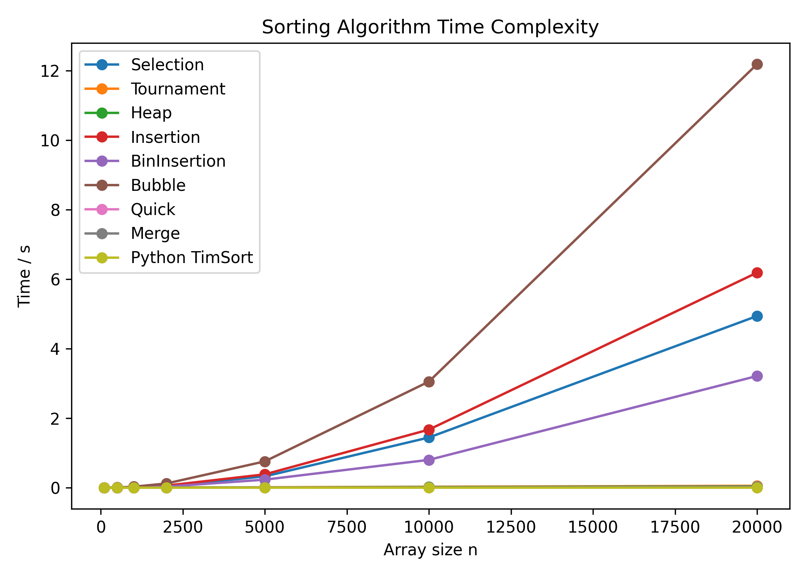
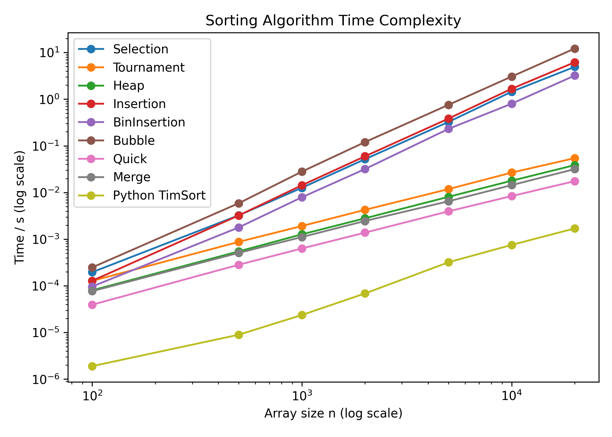

# <center> 排序算法报告
## 直接选择排序
源码
```py
def selection_sort(arr):
    for i in range(len(arr)-1):
        min_idx = i
        for j in range(i+1, len(arr)):
            if arr[j] < arr[min_idx]:
                min_idx = j
        arr[i], arr[min_idx] = arr[min_idx], arr[i]

```
**时间复杂度**：选择排序的最优时间复杂度、平均时间复杂度和最坏时间复杂度均为 $O(n^2)$。
**空间复杂度**：算法运行过程中不需要申请额外的空间，故空间复杂度为 $O(1)$
**稳定与否**：在交换两个数时会改变数的相对顺序，故该算法是不稳定的


## 锦标赛排序
源码
```py
import sys
INF = sys.maxsize 
def tournament_sort(arr):
    n = len(arr)
    if n <= 1:
        return arr.copy()

    tmp = [0] * (n * 2)          # 树节点
    out = [0] * n                # 结果数组

    def winner(pos1, pos2):
        # 叶节点直接取 idx，内部节点取 tmp 里存的 idx
        u = pos1 if pos1 >= n else tmp[pos1]
        v = pos2 if pos2 >= n else tmp[pos2]
        # 稳定关键：<= 保证左边先出
        return u if tmp[u] <= tmp[v] else v

    #建立锦标赛树
    for i in range(n):
        tmp[n + i] = arr[i]      # 叶节点存真实值
    for i in range(2 * n - 1, 1, -2):
        k = i // 2
        tmp[k] = winner(i, i - 1)
    
    #依次选出最小值
    for i in range(n):
        root = tmp[1]            # 当前全局最小所在的叶 idx
        out[i] = tmp[root]   # 写入结果
        tmp[root] = INF      # 标记为“已删除”
        # 沿路径向上重建
        pos = root
        while pos > 1:
            par = pos // 2
            sibling = pos + 1 if pos % 2 == 0 else pos - 1
            tmp[par] = winner(pos, sibling)
            pos = par

    arr[:] = out
```
**时间复杂度**：在整个算法运行的过程中需要构建 $n$ 次 锦标赛树，每次构建之后需要 $ \log n $ 次操作选出最小值，故最后的时间复杂度为 $O(nlogn)$ 
**空间复杂度**：可以观察到算法运行过程中申请了额外的长度为 $2n$ 的空间，故该算法的空间复杂度为 $O(n)$
**稳定与否**：该算法是稳定的，在算法运行过程中，有相同的值的叶节点的相对位置没有变化

<div style="display:flex; gap:2em; justify-content:center;">
  <div style="text-align:center;">
    
  </div>
  <div style="display:flex; gap:2em; justify-content:center;">
    <div style="text-align:center;">
      
    </div>
  </div>
</div>

## 堆排序
源码
```py
def heap_sort(arr):
    n = len(arr)
    # 在给定的区间内构造大顶堆
    def sift_down(arr, start, end):
        # 计算父结点和子结点的下标
        parent = int(start)
        child = int(parent * 2 + 1)
        while child <= end:  # 子结点下标在范围内才做比较
            # 先比较两个子结点大小，选择最大的
            if child + 1 <= end and arr[child] < arr[child + 1]:
                child += 1
            # 如果父结点比子结点大，代表调整完毕，直接跳出函数
            if arr[parent] >= arr[child]:
                return
            else:  # 否则交换父子内容，子结点再和孙结点比较
                arr[parent], arr[child] = arr[child], arr[parent]
                parent = child
                child = int(parent * 2 + 1)

    # 从最后一个节点的父节点开始 sift down 以完成堆化 
    i = ((n - 1) - 1) / 2
    while i >= 0:
        sift_down(arr, i, n - 1)
        i -= 1
    # 先将第一个元素和已经排好的元素前一位做交换，再重新调整（刚调整的元素之前的元素），直到排序完毕
    i = n - 1
    while i > 0:
        arr[0], arr[i] = arr[i], arr[0]
        sift_down(arr, 0, i - 1)
        i -= 1
```
**时间复杂度**：堆排序的最优时间复杂度、平均时间复杂度、最坏时间复杂度均为
$O(n\log n)$。在建立大顶堆的过程中的时间复杂度为  $\sum_{h=0}^{k} \frac{n}{2^{h+1}} \cdot O(k-h) = O\left(n \sum{t=1}^{k} \frac{t}{2^t}\right) = O(n)$, 在排序时，$\sum_{i=n-1}^{1} O(\log i) = O(n \log n) $ 
**空间复杂度**：因为所有操作都是在原来存储乱序数字的数组上进行的，所以空间复杂度为 $O(1)$
**稳定与否**：由于算法中存在交换操作，故其是不稳定的

## 直接插入排序
源码
```py
def insertion_sort(arr):
    for i in range(1, len(arr)):
        key = arr[i]
        j = i - 1
        while j >= 0 and arr[j] > key:
            arr[j + 1] = arr[j]
            j -= 1
        arr[j + 1] = key
```
**时间复杂度**：插入排序的最优时间复杂度为 $O(n)$，在数列几乎有序时效率很高。插入排序的最坏时间复杂度和平均时间复杂度都为 $O(n^2)$。
**空间复杂度**：因为所有操作都是在原来存储乱序数字的数组上进行的，所以空间复杂度为 $O(1)$
**稳定与否**：该算法是稳定的，插入的顺序就是数字在乱序数组中原始的下标的顺序

## 折半插入排序
源码
```py
def binary_insertion_sort(arr):
    for i in range(1, len(arr)):
        key = arr[i]
        # 在已排序区间 [0, i-1] 中二分查找插入位置
        left, right = 0, i
        while left < right:
            mid = (left + right) // 2
            if arr[mid] > key:
                right = mid
            else:
                left = mid + 1
        # 把 [left, i-1] 整体右移一位
        for j in range(i, left, -1):
            arr[j] = arr[j - 1]
        arr[left] = key

```
与直接插入排序类似，区别在于二分优化了时间复杂度中的大常数，在数据数量较大时有较大优势

## 冒泡排序
源码
```py
def bubble_sort(arr):
    n = len(arr)
    for i in range(n):
        swapped = False
        for j in range(0, n-i-1):
            if arr[j] > arr[j+1]:
                arr[j], arr[j+1] = arr[j+1], arr[j]
                swapped = True
        if not swapped:
            break
```
**时间复杂度**：分析算法的运行过程可知，对于长度为n的乱序的数组，需要进行 $n * (1 + n) / 2$ 次操作，故时间复杂度为 $O(n^2)$.
**空间复杂度**：该算法在运行时只需为各个变量创建空间而不要申请额外的空间，故空间复杂度为 $O(1)$
```
7(a) 6 8 7(b) 2 9 5
7(a) 6 8 7(b) 2 5 9
7(a) 6 7(b) 2 5 8 9
6 7(a) 2 5 7(b) 8 9
6 2 5 7(a) 7(b) 8 9
2 5 6 7(a) 7(b) 8 9
```
**稳定与否**：从上面冒泡排序的示例可以看出，冒泡排序是一种稳定的排序算法

## 快速排序
```py
def quick_sort(arr, start, end):
    if start >= end: return
    mid_value = arr[start]
    low = start, high = end
    while low < high:
        while low < high and arr[high] >= mid_value:
            high -= 1
        arr[low] = arr[high]
        while low < high and arr[low] < mid_value:
            low += 1
        arr[high] = arr[low]
    arr[low] = mid_value
    quick_sort(arr, start, low - 1)
    quick_sort(arr, low + 1, end)
```
**时间复杂度**：快速排序的最优时间复杂度和平均时间复杂度为 $O(n\log n)$，最坏时间复杂度为 $O(n^2)$。
**空间复杂度**：因为递归实现需要申请额外的栈帧，且申请的栈帧总数为 $\lfloor \log _2 n\rfloor $ 故该算法的空间复杂度为 $O(n)$
**稳定与否**：因算法中存在大量交换顺序的操作，故该算法是不稳定的    

## 归并排序
源码
```py
def merge_sort(arr):
    if len(arr) > 1:
        mid = len(arr)//2
        L, R = arr[:mid], arr[mid:]
        merge_sort(L); merge_sort(R)
        #此时 [0, mid], [mid + 1, len(arr) - 1] 已经排好顺序了
        i = j = k = 0
        while i < len(L) and j < len(R):
            if L[i] < R[j]:
                arr[k] = L[i]; i += 1
            else:
                arr[k] = R[j]; j += 1
            k += 1
        while i < len(L):
            arr[k] = L[i]; i += 1; k += 1
        while j < len(R):
            arr[k] = R[j]; j += 1; k += 1
```
**时间复杂度**：归并排序基于分治思想将数组分段排序后合并，时间复杂度在最优、最坏与平均情况下均为 $\Theta (n \log n)$。
**空间复杂度**：递归时生成的辅助数组与原数组等长且不需要重复生成，故该算法的空间复杂度为 $\Theta (n)$ 
**稳定与否**：算法运行过程中，每一个元素所属的区间的顺序不会改变，故该算法是稳定的     

## 实验
使用python的random库生成随机的乱序数组，数组长度为`sizes = [100, 500, 1000, 2000, 5000, 10000, 20000]` 7个量级，每种算法在每一个数量级下重复 生成乱序数组 并 排序 3 次以避免因数据特殊而导致某些算法恶化的情况

每种算法的运行时间入下图所示，可以看到，在将坐标轴取对数后，不同时间复杂度的算法差距明显
<div style="display:flex; gap:2em; justify-content:center;">
  <div style="text-align:center;">
    
  </div>
  <div style="display:flex; gap:2em; justify-content:center;">
    <div style="text-align:center;">
      
    </div>
  </div>
</div>


