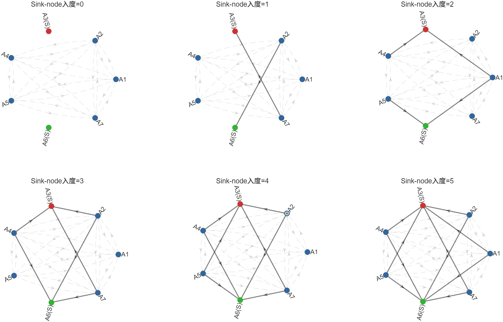
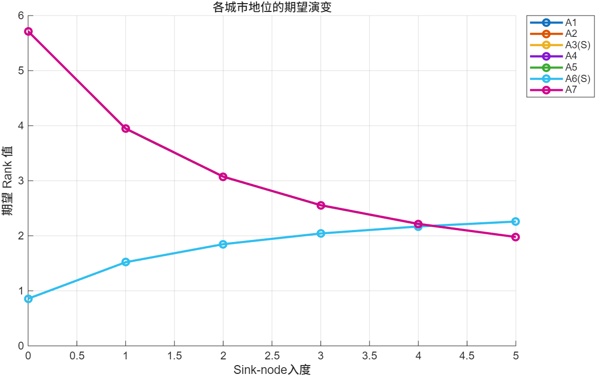
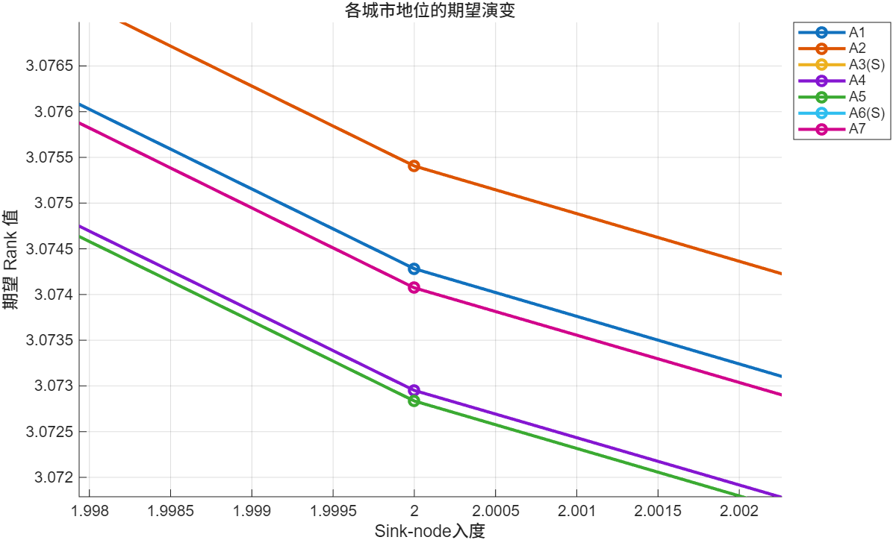

# 
 HW-1-陈新安-郑骏远-卜思翔 

## 问题一
### 1.问题分析
本问题可转换为一个0-1规划问题，每个地点要么选择建立销售中心要么不选择，目标是根据给定的总成本，在满足每个地点的需求的前提下，最大化利润

### 2.模型建立
引入0-1变量 $x_i(i = 1, 2, ..., 7)$ 表示是否在城市 $A_i$ 建立销售中心：
$$
x_i  =
\begin{cases}
1, 在城市 A_i 建立销售中心 \\
0, 不在城市 A_i 建立销售中心
\end{cases}
$$

目标函数是使利润最大化，即：

$$
\max \ z = \sum_{i=1}^7 c_ix_i
$$

为方便`optimproblem`函数求解，我们将最大化问题转化为最小化问题
新的目标函数为:

$$
\min \ z = -\sum_{i=1}^7 c_ix_i
$$

**约束条件为可分为以下5类：**
(1) A1,A2,A3 三地至多建立两个销售中心：
$$
\sum_{i=1}^3 x_i \leqslant 2
$$

(2) A4,A5 两地至少建立一个销售中心：
$$
\sum_{i=4}^5 x_i \geqslant 1
$$

(3) A6,A7 两地至多建立一个销售中心：
$$
\sum_{i=6}^7 x_i \leqslant 1
$$

(4) A1,A7 两地要么同时建立销售中心，要么同时不建立销售中心：
$$
x_1 - x_7 = 0
$$

(5) 总成本不超过预算 $T$ ：
$$
\sum_{i=1}^7 b_ix_i \leqslant T
$$

**综上所述，建立的0-1规划模型如下：**
$$
\min \ z = -\sum_{i=1}^7 c_ix_i  \\
s.t. 
\begin{cases}
x_1 + x_2 + x_3 \leqslant 2 \\
x_4 + x_5 \geqslant 1 \\
x_6 + x_7 \ x_i \leqslant 1 \\
x_1 - x_7 = 0 \\
\sum_{i=1}^7 b_ix_i \leqslant T 
\end{cases}
$$

### 3.模型求解
运用matlab中的`optimproblem`函数求解上述0-1规划问题，针对不同的投资总额进行运算，得到如下结果：
| 投资总额 | a1 | a2 | a3 | a4 | a5 | a6 | a7 | 最大利润 |
| :--- | :--: | :--: | :--: | :--: | :--: | :--: | :--: | :--- |
| 5 | 0 | 0 | 0 | 0 | 0 | 0 | 0 | 0 |
| 10 | 0 | 0 | 0 | 1 | 0 | 1 | 0 | 14 |
| 15 | 0 | 1 | 0 | 1 | 0 | 1 | 0 | 18 |
| 20 | 0 | 0 | 0 | 1 | 1 | 1 | 0 | 22 |
| 25 | 0 | 1 | 0 | 1 | 1 | 1 | 0 | 26 |
| 30 | 0 | 1 | 1 | 1 | 1 | 1 | 0 | 29 |
| 35 | 1 | 1 | 0 | 1 | 1 | 0 | 1 | 32 |
| 40 | 1 | 1 | 0 | 1 | 1 | 0 | 1 | 32 |
| 50 | 1 | 1 | 0 | 1 | 1 | 0 | 1 | 32 |
| 60 | 1 | 1 | 0 | 1 | 1 | 0 | 1 | 32 |

**不同总额下的利润曲线P：**

  

    
  

**热力图：**

  

    
  

### 4.结论

- 1. 建立销售中心，最大利润存在上限，并不随着投资总额的增加而增加，对应到现实中，投资也并不是付出的越多，就能得到的越多。
- 2. 当投资总额一定时，总有一种方法使得利润最大，所以，付出的代价一定时，问题是有最优解的。
- 3. 题中，建立销售中心的约束条件，就如同现实中的外力因素。如A1，A2，A3三个地点最多选两个，可能是这三个地点，都选会可能会导致资源浪费，得到的收益少于理论上的收益。
- 4. 投资总额少时，主导选择的因素是性价比；投资总额多时，主导选择的因素是利润的大小。
---

## 问题二

### 1.问题分析
在问题一中，当投资总额为35时，利润达到最大值32，此时的投资方案为在A1,A2,A4,A5,A7建立销售中心，在A3,A6不建立销售中心。后期随着投资总额的增加，利润不再增加，保持在32不变。

**故选用投资总额为35的方案作为最终方案P。即在城市A1,A2,A4,A5,A7建造销售中心的方案。**

在题目的假设中，将没有被选中的城市 $A_3,A_6$ 设置为 $Sink\text{-}node$。
然而对于 $Sink\text{-}node$ 来说，只定义了其出度为 $0$, 而没有明确定义其入度。

由于没有明确定义 $Sink\text{-}node$ 的入度，使得本题在 $Sink\text{-}node$ 节点的入度的确定上有较高的自由度。

为解决该问题，结合题目已有的定义和约束，我们额外定义：**若两个城市 $A_i$ 和 $A_j$ 之间存在一条 $A_i$ 指向 $A_j$ 的有向边，则认为城市 $A_i$ 将建造销售中心后得到的利润的一部分资助给城市 $A_j$，以支持该公司在城市 $A_j$ 未来业务的发展**

根据以上定义，我们将原问题转换为：**在满足投资方案P的前提下，确定一种每个城市与其他城市的相互之间的资助关系，并通过PageRank算法计算每个城市的相对重要性，以此来确定该公司在每个城市的分部将获得总利润的多少以供未来进一步发展。**

为解决该问题，我们将各城市间的资助关系建模为一个动态演化的随机过程，通过调整 $Sink\text{-}node$ 的入度来模拟公司在不同扩张阶段下的资源配置策略。

### 2.模型建立

#### 2.1 资助关系定义

定义 $a_{ij}$ 以描述城市 $A_i$ 和城市 $A_j$ 之间是否存在上文描述的资助关系:
$$
a_{ij}  =
\begin{cases}
1, 有且仅有一条从城市 A_i 指向城市 A_j 的有向边 \\
0, 不存在一条从城市 A_i 指向城市 A_j 的有向边
\end{cases}
$$

本模型遵循以下约束：
1. 所有被选中建立销售中心的城市之间构成完全图，即相互资助。
2. 由于缺乏定义，为简化模型，未被选中的城市 $A_3$ 和 $A_6$ 定义为 $Sink\text{-}node$。为简化模型，假设 $A_3$ 和 $A_6$ 的入度 $k$ 始终相同，但连接这两座城市的源城市集合可以不完全相同。

#### 2.2 随机演化过程与蒙特卡洛模拟
为了模拟现实商业环境下资助关系的随机性，我们引入蒙特卡洛模拟机制：
1. **随机抽样**：在每一个入度(如无特殊说明，下文中提到的入度均为 $Sink\text{-}node$ 节点的入度)下 ,  $k（k \in \{0, 1, \dots, 5\}）$，从已选中的城市集合 $\{A_1, A_2, A_4, A_5, A_7\}$ 中随机且独立地为 $A_3$ 和 $A_6$ 各抽取 $k$ 个来源城市。
2. **多次模拟取均值**：由于单次随机分配具有偶然性，并且，选中建立销售中心的城市之间构成完全图，具有天然的对称性。故对每个入度 $k$ 进行 1000 次独立重复实验。最终各城市的重要性指标取这 1000 次实验结果的数学期望 $E[R]$，以消除结构扰动，确保评价结果的稳健性。

#### 2.3 转移矩阵 $M$ 的构造
基于上述随机过程，对于特定的入度 $k$，构造相应的转移矩阵 $M$。矩阵元素 $M_{ji}$ 代表城市 $A_i$ 贡献给 $A_j$ 的利润比例：
$$
M_{ji} = \frac{a_{ij}}{\sum_{m=1}^{N} a_{im}}
$$
其中，由于城市 $A_3, A_6$ 作为 $Sink\text{-}node$ 出度为 $0$，其在矩阵中对应的列向量全为 $0$。

#### 2.4 PageRank 算法
引入阻尼因子 $d=0.85$，通过迭代计算得到各城市的平稳分布向量 $R$。
$$
R^{(t+1)} = d \cdot M \cdot R^{(t)} + \frac{1-d}{N} \cdot (\sum C_{total}) \cdot \mathbf{1}
$$
其中，$\sum C_{total}$ 为系统总利润（本题中为 $32$），$\mathbf{1}$ 为全 $1$ 向量。

### 3.模型求解
根据上述建立的模型，我们得到以下结果:

  

    
    

      单次随机过程示意图
    

  

#

每个城市的 $Rank$ 值随 $Sink\text{-}node$ 入度 $k$ 的变化趋势如下图所示：

  

    
    

      Rank值随Sink-node入度变化的趋势图
    

  

  

    
    

      不同折线不完全重合
    

  

# 

不同入度下各城市 Rank 期望值分布表

| 方案阶段 | A1 | A2 | A3(S) | A4 | A5 | A6(S) | A7 |
| :--- | :--- | :--- | :--- | :--- | :--- | :--- | :--- |
| **入度 = 0** | 5.7143 | 5.7143 | 0.85714 | 5.7143 | 5.7143 | 0.85714 | 5.7143 |
| **入度 = 1** | 3.9412 | 3.9472 | 1.5214 | 3.9423 | 3.9416 | 1.5214 | 3.9419 |
| **入度 = 2** | 3.0737 | 3.0685 | 1.8488 | 3.0722 | 3.0686 | 1.8488 | 3.0666 |
| **入度 = 3** | 2.5542 | 2.5540 | 2.0423 | 2.5532 | 2.5514 | 2.0423 | 2.5562 |
| **入度 = 4** | 2.2172 | 2.2174 | 2.1685 | 2.2163 | 2.2176 | 2.1685 | 2.2179 |
| **入度 = 5** | 1.9780 | 1.9780 | 2.2582 | 1.9780 | 1.9780 | 2.2582 | 1.9780 |

**节点分析**
不同入度下各城市的 $Rank$ 值分布表明，随着 $Sink\text{-}node$ 入度的增加，所有城市的 Rank 值趋于均衡，且建造了销售中心的城市的 Rank 值下降较快。在 $Sink\text{-}node$ 入度为5时，其 $Rank$ 值甚至超过了建造了销售中心的城市。

### 4.结论
对于该结果，我们认为:在企业扩张初期资源较紧张的阶段，企业更倾向于将资源集中在已建造销售中心的城市，以巩固其市场地位;随着企业扩张进入后期，资源相对充裕，企业更倾向于将资源分散配置，以支持更多城市的发展，对应到图中 $Sink\text{-}node$ 的 $Rank$ 值逐渐提升。

至于选择何种 $Rank$ 值作为最终结果，我们认为，$Sink\text{-}node$ 入度为 1 或 2 时的 $Rank$ 值更具意义，既保留了对已建销售中心的资源倾斜，又为潜在发展城市提供了适度支持，兼顾当前收益与长期发展。

