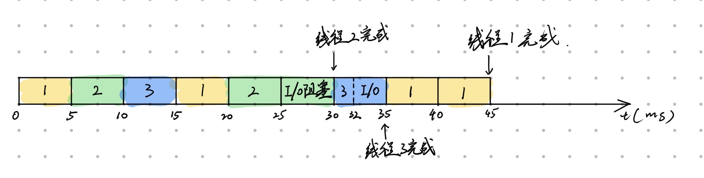
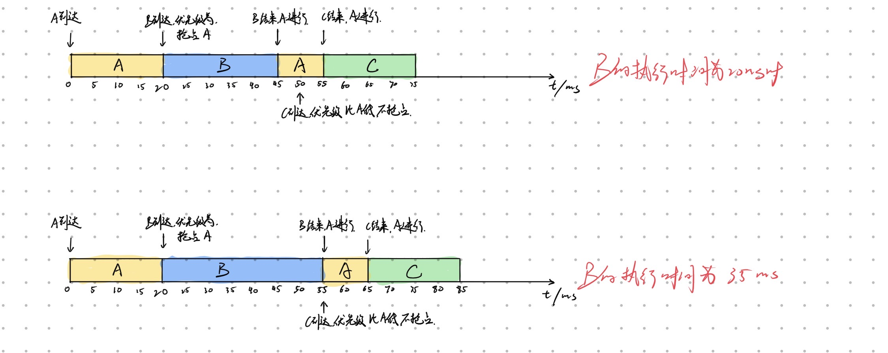
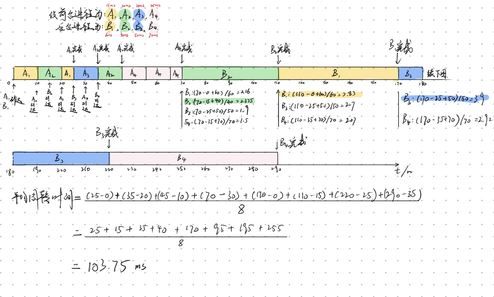
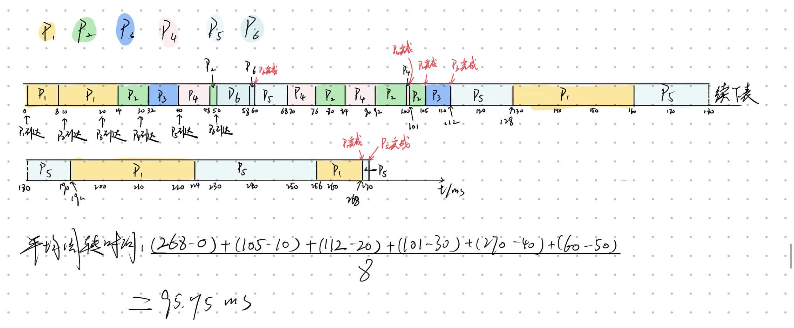

# 
操作系统作业2

## 
202440012028 陈新安

#### 1、对比分析最短作业优先(SJF)、最短剩余时间优先(SRTF)、最高响应比优先(HRRN)三种调度算法的优缺点，分别列举适合它们的应用场景，并说明在何种情况下SRTF的性能会劣于SJF。

**最短作业优先**：根据作业的长短确定任务的优先级。
优点：属于非抢占式调度算法；算法实现简单；可降低平均周转时间。
缺点：难以预先估计每个作业的运行时间；易出现饥饿现象，一直有短作业占用资源导致长作业任务无法执行；无法定义任务的优先级，不能保证紧迫任务的执行：忽略任务的等待时间。
适用场景：可根据已有数据得知任务作业时间，且没有紧迫性作业的场景，如对文件进行批处理等。

**最短剩余时间优先**：根据任务剩余运行时间确定优先级
优点：属于抢占式调度算法，可进一步缩短任务的平均周转时间。
缺点：实现较复杂，需要频繁修改任务的优先级；需要频繁的进程或线程间的切换，资源开销大；长任务更容易出现饥饿的现象。
适应场景：以短任务为主，对平均周转时间要求高，且进程或线程间切换开销小的场景。

**最高响应比优先**：用 等待时间与要求服务时间的和处以要求服务时间 的值的大小计算优先级，越小，优先级越高。
优点：既考虑任务的运行时间，也考虑了任务的等待时间；当长任务等待时间足够长时，其优先级会提高，从而避免饥饿现象的发生
缺点：需要不断计算每个任务的实时的响应比，资源开销大。
适用场景：追求公平性和效率平衡的场景。

**何种情况下 SRTF 性能差于 SJF：**
当需要处理大量短任务时，系统需要频繁进行进程间的切换，直接导致大量资源浪费；
当实际任务的运行时间高于预测的运行时间时。

---
 
#### 2、某分时系统采用时间片轮转调度算法，时间片大小为q。现有n个进程，每个进程的服务时间均为t，且t是q的整数倍。请推导系统的平均周转时间公式，并分析当q趋近于0和q趋近于t时，平均周转时间的变化趋势。

**对于每个进程，其周转时间可分为两部分进行计算：**
1. 在执行第 $(\frac{t}{q}  - 1)$ 个时间片及之前，每个进程都要等待其他进程执行完一个时间片才能进入下一个时间片。因此每个进程的等待时间为 $n * (\frac{t}{q}  - 1) * q$。
2. 在执行最后一个时间片时，第一个执行的进程执行完时间片后就完成了任务，而最后一个执行的进程需要等待前面所有进程执行完最后一个时间片才能完成任务。因此每个进程的等待时间为 $i * q, i = 1, 2, ..., n$。

**所以，总的周转时间为：**
$$
\begin{aligned}
Total & = n * n * (\frac{t}{q}  - 1) * q + \sum_{i=1}^{n} i * q \\
& = n * n * (t - q) + \frac{n(n+1)}{2} * q \\
& = n^2t - n^2q + \frac{n(n+1)}{2} * q
\end{aligned}
$$

**所以平均周转时间为：**
$$
\begin{aligned}
Average & = \frac{Total}{n} \\
& = nt - nq + \frac{(n+1)}{2} * q \\
& = nt - n\frac{q}{2} + \frac{q}{2}
\end{aligned}
$$

当 $q \to 0$ 时，平均周转时间趋近于 $nt$，因为每个进程都需要等待其他进程执行完一个时间片才能进入下一个时间片，导致大量的上下文切换和资源浪费。
当 $q \to t$ 时，平均周转时间趋近于 $\frac{nt}{2} + \frac{t}{2}$，因为每个进程都可以在一个时间片内完成任务，减少了上下文切换的开销，提高了系统的效率。

 
---

#### 3、对比分析批处理系统、分时系统、实时系统的调度目标差异，分别说明它们最适合采用的调度算法，并解释原因。举例说明一个兼具分时和实时功能的操作系统如何实现调度策略。

**调度目标差异：**

批处理系统：追求高吞吐量和系统利用率以最大化产出，对调度的灵活性要求较低。宜使用高响应比优先算法，兼顾任务的等待时间和运行时间的同时防止长任务饥饿现象的发生

分时系统：追求响应时间和调度的公平性，确保每个用户都可以分到一定的资源。宜使用时间片轮转调度算法。

实时系统：要求每个任务都要在其截止时间前完成运作，应使用最早截止时间调度算法以保证任务的实时性。

**举例：**
Linux中，将进程分为实时进程和普通进程。对于实时进程，采用FIFO或RR进行调度。但实时进程会抢占任何普通进程的资源以保证其实时性。普通进程则采用基于公平原则的调度算法来进行资源的分配。
 
---

#### 4、什么是多级反馈队列调度算法?描述其基本原理和调度过程。分析该算法如何兼顾交互性和吞吐量，以及如何通过调整队列数量、时间片大小、优先级转换规则来优化系统性能。

多级反馈调度算法设置了多个就绪队列，每个就绪队列的优先级不同。前一个就绪队列的时间片长度是后一个就绪队列的一半。当一个新进程进入内存后，其会进入第一个就绪队列的队尾，按照FCFS策略等待执行。若其在分配的时间片内未完成，则放入后一个就绪队列的队尾。同时，只有当前队列的前一个队列空闲时，才调度当前队列的的进程运行。在最后一个优先队列中，使用RR算法进行调度。

该算法通过为不同就绪队列设置不同的时间片长度，兼顾了吞吐量和交互性。一方面，时间片长度短的队列可以快速处理短任务而不浪费cpu资源，另一方面，时间片长的队列可以保证长任务不需要频繁进行切换而浪费资源，从而提高系统的吞吐量。

通过预先设定的就绪队列数量以及各队列内部的调度算法，同时确定时间片的大小和优先级转换规则，该算法的性能得以提高。

---

#### 5、在实时系统中，什么是调度的可调度性分析?列举至少三种可调度性分析方法，并对比它们的优缺点。说明在强实时系统和弱实时系统中，可调度性分析的区别。

**可调度性分析是指:** 一组给定任务在特定的调度算法下，分析其是否能在所有情况下都满足其截止时间限制。

**利用率上界分析:** 检查任务集合的总利用率是否小于或等于调度算法的理论上界（如RMS的上界为n(2^(1/n)-1)）。优点：简单易行；缺点：过于保守，可能会误判可调度的任务集合为不可调度。
**响应时间分析:** 计算每个任务的最坏情况响应时间，并检查是否满足截止时间要求。优点：更准确地评估任务集合的可调度性；缺点：计算复杂度较高，尤其是对于大量任务的系统。
**处理器需求分析:** 在任意时间间隔内，计算所有任务产生的总负载需求是否小于可用的 CPU 时间。优点：适用于动态任务集合；缺点：需要对任务的到达模式和执行时间有详细的了解。

区别：HRT要求在最坏情况下没有任何任务会错过截止时间，而SRT只需要保证平均性能达标，允许极少量任务错过截止时间。
 
---

#### 6、某多核系统采用全局调度和局部调度两种策略，描述这两种调度策略的基本原理，分析它们的优缺点，并说明在何种场景下适合采用全局调度，何种场景下适合采用局部调度。结合Linux操作系统，说明其多核调度策略的演进过程。

**全局调度：** 系统维护一个全局的就绪队列。有核空闲时，执行队列中优先级最高的任务。
优点：资源利用率高；响应速度快。
缺点：各核之间的同步开销大；需要频繁更换cache。
适用场景：核心数量少，同步开销低的系统

**局部调度：** 每个核拥有各自的就绪队列。
优点：cache不易失效；同步开销小，方便拓展。
缺点：易出现某一核任务堆积而其他核空闲的情况。
适用场景：核心数量多的计算密集型或高并发的系统
 
**策略演进：** 早期使用带有局部调度的思想的O（1）调度算法，每个cpu一个就绪队列，交互性较差。中期使用CFS算法，采用红黑树管理进程，且每个cpu内仍维护独立的就绪队列。后期使用EDF算法进行调度。

---

#### 7、在一个实时系统中，有3个周期性实时任务，任务A周期为20ms，执行时间为10ms；任务B周期为30ms，执行时间为10ms；任务C周期为40ms，执行时间为15ms。采用速率单调调度算法(RMS)，判断这三个任务是否可调度，并说明理由。若不可调度，提出两种改进方案。

不可调度，理由如下：
$$
\begin{aligned}
U = \sum_{i=1}^{n} \frac{C_i}{T_i} = \frac{10}{20} + \frac{10}{30} + \frac{15}{40} = 0.5 + 0.3333 + 0.375 = 1.2083 > 1
\end{aligned}
$$

改进方案：1、适当延长任务时间，在不影响业务的前提下；2、优化每个任务的运行时间；3、多核处理

---

#### 8、某系统支持用户级线程(ULT)和内核级线程(KLT)，现有一个进程包含4个用户级线程，进程被分配了2个内核级线程。每个用户级线程的执行时间为10ms，其中包含2ms的I/O等待时间。请计算该进程完成所有线程执行的总时间，并分析如果采用1:1线程模型（一个ULT对应一个KLT），总时间会有什么变化，说明原因。

$$
4ULT +2 KLT：8ms + 8ms + 2ms + 2ms = 20ms \\
4ULT + 4KLT：8ms + 2ms + 2ms + 2ms = 14ms
$$
线程的执行可以并行，但I/O 输出一般不可并行，故需要等待。
 
---

#### 9、对比分析用户级线程调度和内核级线程调度的核心差异，包括调度主体、调度时机、上下文切换开销、并发性支持四个维度。举例说明在I/O密集型和CPU密集型应用场景下，两种线程模型的性能表现差异。

**调度主体** ：ULT为进程的用户空间内的线程库，KLT为操作系统内核
**调度时机：** ULT为分配给进程的时间片到期时，KLT为内核触发IO阻塞或线程切换时。
上下文切换开销：ULT只需要刷新每个线程特有的寄存器内容和栈指针，KLT需要切换到内核方式来进行线程管理。
**并发性支持：** 一个ULT被阻塞，所有对应进程下的线程都会被阻塞。KLT原生调用多个同一进程下的线程并行运行。

在I/O密集型的场景下，ULT表现较差，因为单一一个ULT被阻塞会连带着其他线程被阻塞。由于KLT对并发的支持性较好，性能表现较好。
在计算密集型的场景下，ULT表现较好，因为其进程间切换的开销较小，无需进入内核态。
 
---

#### 10、某实时系统采用优先级调度算法，有3个周期性实时线程，线程A周期为50ms，执行时间为20ms；线程B周期为100ms，执行时间为30ms；线程C周期为150ms，执行时间为40ms。采用速率单调调度(RMS)算法，判断这三个线程是否可调度。如果线程B的执行时间增加到40ms，系统是否仍然可调度?说明理由。

$$
\begin{aligned}
U &= \sum_{i=1}^{n} \frac{C_i}{T_i} \\
& = \frac{20}{50} + \frac{30}{100} + \frac{40}{150} \\
& = 0.4 + 0.3 + 0.2667 \\
& = 0.9667 < 1
\end{aligned}
$$
所以，原系统可调度

若线程B的执行时间增加到40ms，则：
$$
\begin{aligned}
U &= \sum_{i=1}^{n} \frac{C_i}{T_i} \\
& = \frac{20}{50} + \frac{40}{100} + \frac{40}{150} \\
& = 0.4 + 0.4 + 0.2667 \\   
& = 1.0667 > 1
\end{aligned}
$$
所以，系统不可调度，因为总的CPU利用率超过了100%，无法满足所有线程的截止时间要求。

---

#### 11、某系统实现了用户级线程库，采用轮转调度算法，时间片为5ms。现有一个进程包含3个用户级线程，线程1执行时间为20ms（无I/O），线程2执行时间为15ms（包含5ms I/O），线程3执行时间为10ms（包含3ms I/O）。请画出线程调度的时间线，计算每个线程的完成时间和响应时间，并分析用户级线程调度中I/O操作对调度的影响。

  

    
  

线程1：完成时间为45ms，响应时间为0ms
线程2：完成时间为30ms，响应时间为5ms
线程3：完成时间为35ms，响应时间为10ms

---

#### 12、分析Linux操作系统中CFS（完全公平调度器）的核心原理，包括红黑树数据结构的作用、虚拟运行时间(vruntime)的计算方法、调度时机。说明CFS如何实现"公平调度"，以及在多线程场景下如何避免饥饿问题。

CFS调度算法没有直接分配优先级，它通过每个任务的变量vruntime来维护虚拟运行时间，进而记录每个任务运行了多久。虚拟运行时间与任务优先级有关：如果一个默认优先级的任务运行100ms，则它的vruntime也为100ms。如果一个较低优先级的任务运行100ms，则它的vruntime将大于100ms。如果一个较高优先级的任务运行100ms，则它的vruntime将小于100ms。
CFS调度算法利用红黑树选择具有最小vruntime值的任务，查找的复杂度为O（1），插入和删除的复杂度为O（log N）。红黑树可以动态地维护vruntime的节点。
vruntime = vruntime + delta_exec（ NICE_0_LOAD / weight）
delta_exec为进程实际执行的物理时间
NICE_0_LOAD 为nice为0时的基准权重 nice取值范围为-20到19
weight 为当前进程的权重

**调度时机：** 当周期性的时钟中断，任务状态改变，阻塞操作发生时，CFS会进行抢占式调度。

**完全公平：** 系统自适应地为进程分配动态的时间片，无论系统负载程度有多高，都可以在目标延迟周期内轮转一遍。

**避免饥饿：** 通过动态调整权重以及设置最小的vruntime值，避免某个进程长时间霸占cpu资源。
 
---

#### 13、某实时系统采用最早截止时间优先(EDF)调度算法，有3个非周期性实时线程，线程A的到达时间为0ms，截止时间为100ms，执行时间为30ms；线程B的到达时间为20ms，截止时间为80ms，执行时间为25ms；线程C的到达时间为50ms，截止时间为120ms，执行时间为20ms。请画出调度时间线，判断每个线程是否能在截止时间前完成，并分析如果线程B的执行时间增加到35ms，系统会发生什么情况。

  

    
  

 
---

#### 14、解释线程调度中的"优先级反转"问题，说明其产生的原因和危害。列举至少两种解决优先级反转的方法，并对比它们的实现复杂度和性能开销。

**优先级反转**：当一个高优先级线程被一个低优先级线程间接阻塞，导致中等优先级线程抢占了 CPU，使得高优先级线程无法运行的现象

**危害**：破坏系统的实时性，使系统变得无法预测；可能导致系统性能下降，甚至死锁。

**解决方法：**
1. 规定进程进入临界区后，禁止被抢占，直到退出临界区。实现复杂度较低，但可能导致系统响应时间增加。适用于系统的临界区都较短且不多的情况下。
2. 使用动态优先级继承机制：当一个高优先级线程被一个低优先级线程阻塞时，低优先级线程会暂时继承高优先级线程的优先级，直到它释放资源。实现复杂度较高，但可以有效解决优先级反转问题，适用于系统中存在多个临界区且临界区较长的情况下。
 
---

#### 15、某系统采用混合调度策略:前台交互进程采用时间片轮转（时间片10ms），后台批处理进程采用最高响应比优先(HRRN)。现有8个进程，其中4个前台进程（到达时间0ms、10ms、20ms、30ms，服务时间15ms、20ms、10ms、25ms），4个后台进程（到达时间0ms、15ms、25ms、35ms，服务时间60ms、40ms、50ms、70ms）。前台进程优先级高于后台进程，只有当前台队列为空时才调度后台进程。请计算平均周转时间，并分析该混合策略的性能优势。

  

    
  

**性能优势：**
1. 前台进程可快速响应，防止后台进程阻塞
2. 防止后台饥饿现象的发生
3. 系统稳定且可预测，适用于同时处理交互性和批处理任务的场景
4. 整体资源利用率高，吞吐量大

---

#### 16、分析处理机调度中的"公平共享调度"的核心原理，包括公平性指标（如最大最小公平、比例公平）、调度算法的实现（如加权公平队列、彩票调度）。举例说明在云计算、Web服务、操作系统中，公平共享调度的应用场景。

**最大最小公平**：确保每个任务至少获得一个最小的资源份额，同时最大化未分配资源的利用率。
**比例公平**：根据任务的权重分配资源，确保每个任务获得的资源与其权重成比例。

**加权公平队列**：维护一个队列，分配一个权重，根据权重计算每个任务的虚拟运行时间，优先调度虚拟运行时间最小的任务。

**彩票调度**：为每个任务分配一定数量的彩票，调度时随机抽取彩票来决定哪个任务获得资源，确保每个任务都有机会获得资源。

**应用场景：** 
1. 云计算： 多用户资源隔离，防止某个用户的异常高负载导致同一物理机上的其他用户业务崩溃。
2. Web服务： 通过加权公平队列调度算法，确保不同优先级的请求得到合理的资源分配，保证关键节点的响应时间。
3. 操作系统： 通过公平共享调度算法，确保系统中的所有进程都能获得公平的CPU时间，防止某些进程长时间占用资源导致其他进程饥饿。

 
---

#### 17、对比分析处理机调度中的"静态优先级"和"动态优先级"的优缺点，包括调度灵活性、系统开销、公平性三个维度。说明在Windows、Linux、UNIX三种操作系统中，分别采用了哪些优先级调整策略（如优先级提升、老化机制）来优化调度性能。

**静态优先级**：
优点：实现简单；系统开销低，只需要根据预设的优先级进行调度。
缺点：缺乏灵活性，无法适应动态变化的系统负载；可能导致优先级反转和饥饿现象。

**动态优先级**：
优点：调度灵活，可以根据系统负载和任务行为动态调整优先级；可通过“老化”机制防止饥饿现象。
缺点：实现复杂；系统开销较高，需要频繁调整优先级。

**Windows**：基于多级反馈队列的动态优先级策略；
**Linux**：采用完全公平调度器（CFS），通过动态调整虚拟运行时间来实现动态优先级；
**UNIX**：进程每占用 CPU 一段时间，其优先级就会下降；进程在就绪队列中每等待一秒，其优先级就会上升。

---

#### 18、某系统采用混合调度策略:前台交互进程采用时间片轮转（时间片10ms），后台批处理进程采用最高响应比优先(HRRN)。现有8个进程，其中4个前台进程（到达时间0ms、10ms、20ms、30ms，服务时间15ms、20ms、10ms、25ms），4个后台进程（到达时间0ms、15ms、25ms、35ms，服务时间60ms、40ms、50ms、70ms）。前台进程优先级高于后台进程，只有当前台队列为空时才调度后台进程。请计算平均周转时间，并分析该混合策略的性能优势。

同 T15, 略
 
---

#### 19、某系统采用三级反馈队列调度算法，队列1、2、3的时间片分别为8ms、16ms、32ms，优先级依次降低。现有6个进程，到达时间和服务时间如下: 
| 进程 | 到达时间(ms) | 服务时间(ms) | 类型 | 
|------|--------------|--------------|------------| 
| P1 | 0 | 100 | CPU密集型 | 
| P2 | 10 | 30 | I/O密集型 | 
| P3 | 20 | 15 | CPU密集型 | 
| P4 | 30 | 25 | I/O密集型 | 
| P5 | 40 | 90 | CPU密集型 | 
| P6 | 50 | 10 | 交互型 | 

I/O密集型进程每次I/O完成后会回到最高优先级队列，CPU密集型进程时间片用完后降一级队列。请画出Gantt图，计算平均周转时间，并分析该算法对不同类型进程的调度性能。

  

    
  

对于CPU密集型进程，调度性能较差，因为它们会频繁地被降级到较低优先级的队列中，导致响应时间增加。
对于I/O密集型进程，调度性能较好，因为它们在完成I/O操作后会回到最高优先级的队列中，能够更快地获得CPU资源。
对于交互型进程，调度性能较好，因为它们会直接进入最高优先级的队列中，能够快速响应用户的交互请求。

---

#### 20、请设计一个用户级线程库的核心调度模块，要求支持以下功能:
> 轮转调度（时间片可配置）
> 优先级调度（支持动态优先级调整）
> 抢占式调度（可通过信号触发抢占）
> 线程阻塞/唤醒（支持I/O等待、互斥锁等待）
> 请详细描述调度模块的数据结构设计（如就绪队列、阻塞队列、线程控制块TCB）、调度算法实现逻辑、以及与内核级线程的交互方式。
> 分析该用户级线程库在CPU密集型和I/O密集型应用场景下的性能瓶颈，并提出优化方案

**数据结构设计：**
- 线程控制块（TCB）：包含线程ID、状态（就绪、运行、阻塞）、优先级、时间片剩余时间、上下文信息等。
  - 线程ID：唯一标识一个线程。
  - 状态：表示线程当前的状态，如就绪、运行、阻塞等
  - 优先级：用于优先级调度，动态调整时需要更新该字段。
  - 上下文信息：保存线程的寄存器状态、栈指针等，以便在线程切换时恢复。
  - 时间片剩余长度
  - 栈空间
 
-  就绪队列：一个优先级队列，按照线程的优先级和时间片剩余时间进行排序。
   -  使用红黑树维护
-  阻塞队列：一个链表，存储所有处于阻塞状态的线程。
   -  分为I/O等待队列和互斥锁等待队列

**调度算法实现逻辑：**
轮转调度和优先级调度结合使用，首先根据优先级选择就绪队列中的线程，如果有多个线程具有相同的优先级，则按照时间片轮转调度。

抢占式调度通过设置一个定时器，当时间片用完或有更高优先级的线程到达时，触发信号进行抢占。线程阻塞/唤醒通过将线程状态设置为阻塞，并将其加入相应的阻塞队列中。当I/O操作完成或互斥锁释放时，唤醒对应的线程，将其状态设置为就绪，并加入就绪队列。

**与内核级线程的交互方式：**
用户级线程库通过系统调用与内核级线程进行交互。当用户级线程需要进行上下文切换、阻塞或唤醒时，调用相应的系统调用来通知内核进行调度。内核级线程负责实际的CPU调度和资源管理，而用户级线程库则负责管理线程的状态和调度逻辑。

**性能瓶颈分析：**
- CPU密集型应用：频繁的上下文切换和抢占可能导致性能下降。优化方案：增加时间片长度，减少上下文切换的频率；使用更高效的数据结构来管理就绪队列。
- I/O密集型应用：线程频繁阻塞和唤醒可能导致性能下降。优化方案：使用事件驱动模型，减少线程的阻塞和唤醒次数；优化I/O操作的处理逻辑，减少I/O等待时间。

