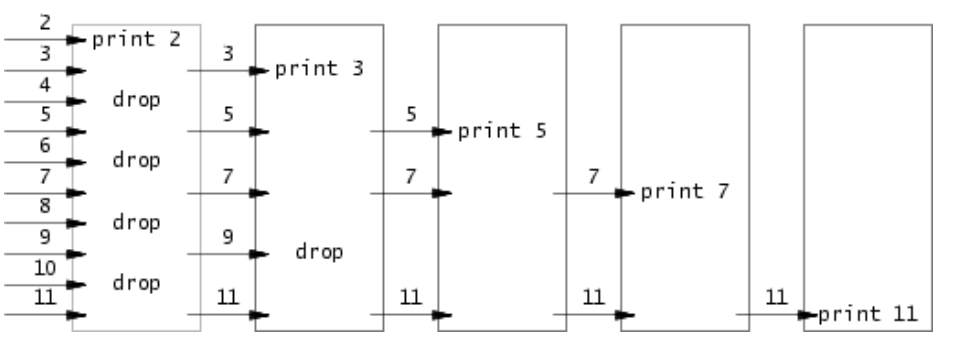

[TOC]

# sleep
> YOUR JOB
> **实现xv6的UNIX程序**`sleep`**：您的**`sleep`**应该暂停到用户指定的计时数。一个滴答(tick)是由xv6内核定义的时间概念，即来自定时器芯片的两个中断之间的时间。您的解决方案应该在文件*user/sleep.c*中**
```c
#include "kernel/types.h"
#include "user/user.h"

int main(int argc, char const *argv[])
{
  printf("sleep: start\n");
  
  // 1. 检查参数数量：argv[0]是"sleep"，argv[1]是数字
  if (argc != 2) { //参数错误
    fprintf(2, "usage: sleep <time>\n");
    exit(1);
  }

  //printf("sleep: sleeping for %d ticks\n", atoi(argv[1]));

  sleep(atoi(argv[1]));

  //printf("sleep: woke up\n");

  exit(0);
}
```

整活
```c
#include "kernel/types.h"
#include "user/user.h"

int main(int argc, char const *argv[])
{
  if (argc != 2) {
    fprintf(2, "usage: sleep <total_ticks>\n");
    exit(1);
  }

  int total_ticks = atoi(argv[1]);
  int interval = 10; // 假设 10 ticks 为 1 秒
  int elapsed = 0;

  printf("CharlesOS: Start sleeping (Total: %d ticks)\n", total_ticks);

  // 核心循环逻辑
  while (elapsed < total_ticks) {
    // 计算本次应该睡多久（防止最后一次超出总时长）
    int remaining = total_ticks - elapsed;
    int sleep_now = (remaining < interval) ? remaining : interval;

    sleep(sleep_now);
    elapsed += sleep_now;

    printf("CharlesOS: Process [%d/%d] second elapsed...\n", elapsed / 10, total_ticks / 10);
  }

  printf("CharlesOS: Woke up! Task finished.\n");
  exit(0);
}
```

---

# Pingpong
> YOUR JOB
> 编写一个使用UNIX系统调用的程序来在两个进程之间“ping-pong”一个字节.
> 请使用两个管道，每个方向一个。
> 父进程应该向子进程发送一个字节;子进程应该打印“`<pid>: received ping`”，其中`<pid>`是进程ID，并在管道中写入字节发送给父进程，然后退出;
> 父级应该从读取从子进程而来的字节，打印“`<pid>: received pong`”，然后退出。您的解决方案应该在文件*user/pingpong.c*中。

tips: 不需要额外关掉原来的0,1两个FD，直接在写入和读取的地方输入pipe的fd即可。最后记得关闭所有不需要的fd，防止资源泄露。
```c
#include "kernel/types.h"
#include "user/user.h"

int main(int argc, char *argv[]) {
    int p1[2]; 
    int p2[2];
    char buf[1];

    pipe(p1); //子进程读 父进程写
    pipe(p2); //父进程读 子进程写

    if (fork() == 0) { //子进程
        close(p2[0]); // 关闭父进程读端
        close(p1[1]); // 关闭父进程写端
        
        if (read(p1[0], buf, 1) != 1) {
            printf("子进程读取失败\n");
            exit(1);
        }

        printf("%d: received ping\n", getpid());

        write(p2[1], buf, 1);

        close(p1[0]); // 读取完成后关闭读端
        close(p2[1]); // 写入完成后关闭写端

        exit(0);

    } else {
        close(p2[1]); // 关闭子进程写端
        close(p1[0]); // 关闭子进程读端

        write(p1[1], "a", 1);

        if (read(p2[0], buf, 1) != 1) {
            printf("父进程读取失败\n");
            exit(1);
        }

        printf("%d: received pong\n", getpid());

        close(p1[1]); // 写入完成后关闭写端
        close(p2[0]); // 读取完成后关闭读端
        wait(0); // 等待子进程退出
    }

    exit(0);
}
```
不想只传递一个字节，可以传递一个字符串，父进程发送"ping"，子进程回复"pong"，这样输出会更有趣一些。
```c
#include "kernel/types.h"
#include "user/user.h"

int main(int argc, char *argv[]) {
    int p1[2]; // 父 -> 子
    int p2[2]; // 子 -> 父
    char buf[16]; // 足够大的缓冲区

    pipe(p1);
    pipe(p2);

    if (fork() == 0) { // 子进程
        close(p1[1]); 
        close(p2[0]); 

        // 1. 读取父进程发来的 "ping" (4个字节)
        // 注意：read 返回实际读取的字节数
        int n = read(p1[0], buf, 20);
        if (n > 0) {
            buf[n] = '\0'; // 加上字符串结束符，方便 printf 打印
            printf("%d: received %s\n", getpid(), buf);
        }

        // 2. 向父进程发送 "pong" (4个字节)
        write(p2[1], "pong form children", 19);

        close(p1[0]);
        close(p2[1]);
        exit(0);

    } else { // 父进程
        close(p1[0]);
        close(p2[1]);

        // 1. 发送 "ping"
        write(p1[1], "ping from parent", 17);

        // 2. 读取子进程回发的 "pong"
        int n = read(p2[0], buf, 20);
        if (n > 0) {
            buf[n] = '\0'; // 结束符
            printf("%d: received %s\n", getpid(), buf);
        }

        close(p1[1]);
        close(p2[0]);
        wait(0);
    }

    exit(0);
}
```

---

# Primes
> YOUR JOB
>  使用管道编写prime sieve(筛选素数)的并发版本。这个想法是由Unix管道的发明者Doug McIlroy提出的。您的解决方案应该在user/primes.c文件中。

基本实现逻辑如下：
维护多个进程，每个进程负责过滤掉某个素数的倍数。父进程生成自然数流，子进程读取这个流，输出第一个数（即当前素数），然后创建下一个子进程来过滤掉这个素数的倍数。这样每个新进程都会过滤掉一个新的素数的倍数，最终输出所有素数。

<div style="display:flex; gap:2em; justify-content:center;">
  <div style="text-align:center;">
    
  </div>
</div>

```c
#include "kernel/types.h"
#include "user/user.h"

#define RD 0
#define WR 1

const uint INT_LEN = sizeof(int);

/**
 * @brief 读取左邻居的第一个数据
 * @param lpipe 左邻居的管道符
 * @param dst 用于存储第一个数据的地址
 * @return 如果没有数据返回-1,有数据返回0
 */
int lpipe_first_data(int lpipe[2], int *dst)
{
  if (read(lpipe[RD], dst, sizeof(int)) == sizeof(int)) {
    printf("prime %d\n", *dst);
    return 0;
  }                                                                                                                                                                                      
  return -1;
}

/**
 * 
 * @brief 读取左邻居的数据，将不能被first整除的写入右邻居
 * @param lpipe 左邻居的管道符
 * @param rpipe 右邻居的管道符
 * @param first 左邻居的第一个数据
 */
void transmit_data(int lpipe[2], int rpipe[2], int first)
{
  int data;
  // 从左管道读取数据
  while (read(lpipe[RD], &data, sizeof(int)) == sizeof(int)) {
    // 将无法整除的数据传递入右管道
    if (data % first)
      write(rpipe[WR], &data, sizeof(int));
  }
  close(lpipe[RD]);
  close(rpipe[WR]);
}

/**
 * @brief 寻找素数
 * @param lpipe 左邻居管道
 */
void primes(int lpipe[2])
{
  close(lpipe[WR]);
  int first;
  if (lpipe_first_data(lpipe, &first) == 0) {
    int p[2];
    pipe(p); // 当前的管道
    transmit_data(lpipe, p, first);

    if (fork() == 0) {
      primes(p);    // 递归的思想，但这将在一个新的进程中调用
    } else {
      close(p[RD]);
      wait(0);
    }
  }
  exit(0);
}

int main(int argc, char const *argv[])
{
  int p[2]; 
  pipe(p); 

  for (int i = 2; i <= 35; ++i) //写入初始数据
    write(p[WR], &i, INT_LEN);

  if (fork() == 0) { //子进程
    primes(p);
  } else {
    close(p[WR]);
    close(p[RD]);
    wait(0);
  }

  exit(0);
}

```

---


