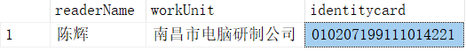
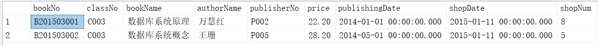
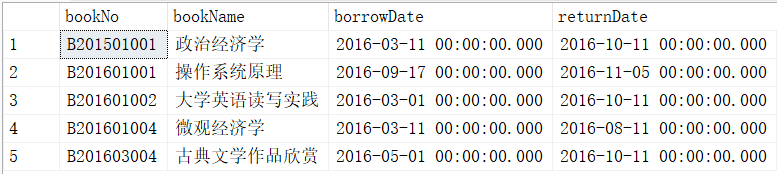
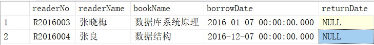
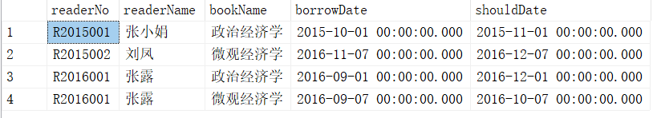
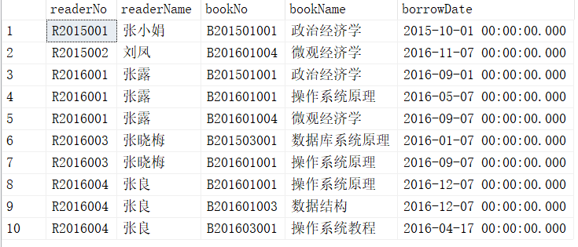
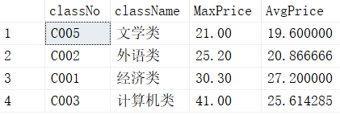
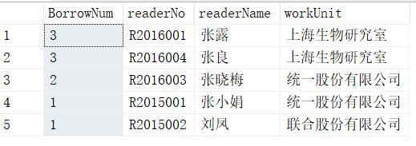

# <center>SQL Homework 2</center>
## <center>202440012028 陈新安</center>


#### ./photos/3.1 查询 1991 年出生的读者姓名、工作单位和身份证号。
```sql
SELECT readerName, workUnit, identitycard
FROM dbo.Reader
WHERE SUBSTRING(identitycard, 7, 4) = '1991';
```
<div style="display:flex; gap:2em; justify-content:center;">
  <div style="text-align:center;">
    
  </div>
</div>

---

#### ./photos/3.2 查询图书名中含有“数据库”的图书的详细信息。
```sql
SELECT *
FROM dbo.Book
WHERE bookName LIKE '%数据库%';
```
<div style="display:flex; gap:2em; justify-content:center;">
  <div style="text-align:center;">
    
  </div>
</div>

---

#### ./photos/3.3 查询在 2015—2016 年之间入库的图书编号、出版时间、入库时间和图书名称，并按入库时间的降序排序输出。
```sql
SELECT bookNo, publishingDate, shopDate, bookName
FROM dbo.Book
WHERE shopDate BETWEEN '2015-01-01' AND '2016-12-31';
ORDER BY shopDate DESC;
```
<div style="display:flex; gap:2em; justify-content:center;">
  <div style="text-align:center;">
    
  </div>
</div>


---

#### ./photos/3.4 查询读者“喻自强”借阅的图书编号、图书名称、借书日期和归还日期。
```sql
SELECT 
	borrow.bookNo, 
	book.bookName, 
	borrow.borrowDate, 
	borrow.returnDate
FROM
    dbo.Borrow AS borrow
JOIN dbo.Reader AS reader ON borrow.readerNo = reader.readerNo
JOIN dbo.Book AS book ON borrow.bookNo = book.bookNo
WHERE reader.readerName = '喻自强';
```

<div style="display:flex; gap:2em; justify-content:center;">
  <div style="text-align:center;">
    
  </div>
</div>

---

#### ./photos/3.5 查询借阅了清华大学出版社出版的图书的读者编号、读者姓名、图书名称、借书日期和归还日期。
```sql

SELECT 
	r.readerNo,
	r.readerName,
	b.bookName,
	bw.borrowDate,
	bw.returnDate
FROM
	dbo.Reader AS r
JOIN dbo.Borrow AS bw ON r.readerNo = bw.readerNo	
JOIN dbo.Book AS b ON b.bookNo = bw.bookNo
JOIN dbo.Publisher AS p ON b.publisherNo = p.publisherNo
WHERE  p.publisherName = '清华大学出版社'
```

<div style="display:flex; gap:2em; justify-content:center;">
  <div style="text-align:center;">
    
  </div>
</div>

---

#### ./photos/3.6 查询会计学院没有归还所借图书的读者编号、读者姓名、图书名称、借书日期和应归还日期。
```sql
SELECT 
	r.readerNo,
	r.readerName,
	bk.bookName,
	bw.borrowDate,
	bw.shouldDate
FROM 
	dbo.Book as bk
JOIN dbo.Borrow AS bw ON bk.bookNo = bw.bookNo
JOIN dbo.Reader AS r ON r.readerNo = bw.readerNo
JOIN dbo.BookClass AS bc on bc.classNo = bk.classNo
WHERE bc.classNo = 'C001'
	AND bw.returnDate IS NULL;
```
<div style="display:flex; gap:2em; justify-content:center;">
  <div style="text-align:center;">
    
  </div>
</div>

---


#### ./photos/3.7 查询在 2015—2016 年之间借阅但还未归还图书的读者编号、读者姓名以及这些借阅未归还图书的图书编号、图书名称和借书日期。
```sql
SELECT 
	r.readerNo,
	r.readerName,
	bk.bookNo,
	bk.bookName,
	bw.borrowDate
FROM 
	dbo.Book as bk
JOIN dbo.Borrow AS bw ON bk.bookNo = bw.bookNo
JOIN dbo.Reader AS r ON r.readerNo = bw.readerNo
WHERE bw.returnDate IS NULL
	AND YEAR(bw.borrowDate) BETWEEN '2015' AND '2016';
```
<div style="display:flex; gap:2em; justify-content:center;">
  <div style="text-align:center;">
    
  </div>
</div>

---

#### ./photos/3.8 查询每种类别图书的分类号、分类名称、最高价格和平均价格，并按最高价格的升序输出。
```sql
SELECT 
    bc.classNo, 
    bc.className, 
    MAX(bk.price) AS MaxPrice, 
    AVG(bk.price) AS AvgPrice
FROM dbo.BookClass AS bc
JOIN dbo.Book AS bk ON bc.classNo = bk.classNo
GROUP BY bc.classNo, bc.className
ORDER BY MaxPrice ; 
```
<div style="display:flex; gap:2em; justify-content:center;">
  <div style="text-align:center;">
    
  </div>
</div>

--- 

#### ./photos/3.9 查询每个读者在借（即借阅未归还）的图书数量、读者编号、读者姓名和工作单位，并按借书数量的降序排序输出。
```sql
SELECT 
    COUNT(*) AS BorrowNum,     
    r.readerNo,                
    r.readerName,              
    r.workUnit                 
FROM dbo.Reader AS r
JOIN dbo.Borrow AS bw ON r.readerNo = bw.readerNo
WHERE bw.returnDate IS NULL    
GROUP BY r.readerNo, r.readerName, r.workUnit 
ORDER BY BorrowNum DESC;       
```
<div style="display:flex; gap:2em; justify-content:center;">
  <div style="text-align:center;">
    
  </div>
</div>

---


#### ./photos/3.10 查询每个出版社出版的每种类别的图书平均价格，要求显示出版社名称、图书类别名称和平均价格。
```sql
SELECT 
    p.publisherName, 
    bc.className, 
    AVG(bk.price) AS AvgPrice
FROM dbo.Publisher AS p
JOIN dbo.Book AS bk ON p.publisherNo = bk.publisherNo
JOIN dbo.BookClass AS bc ON bk.classNo = bc.classNo
GROUP BY p.publisherName, bc.className;
```
<div style="display:flex; gap:2em; justify-content:center;">
  <div style="text-align:center;">
    
  </div>
</div>

---

#### 3.11 查询在借图书的总价不低于 200 元的读者编号、读者姓名和在借图书总价。
```sql
SELECT 
    r.readerNo, 
    r.readerName, 
    SUM(bk.price) AS TotalPrice
FROM dbo.Reader AS r
JOIN dbo.Borrow AS bw ON r.readerNo = bw.readerNo
JOIN dbo.Book AS bk ON bw.bookNo = bk.bookNo
WHERE bw.returnDate IS NULL  
GROUP BY r.readerNo, r.readerName
HAVING SUM(bk.price) >= 200;  
```
不存在这样的读者

---