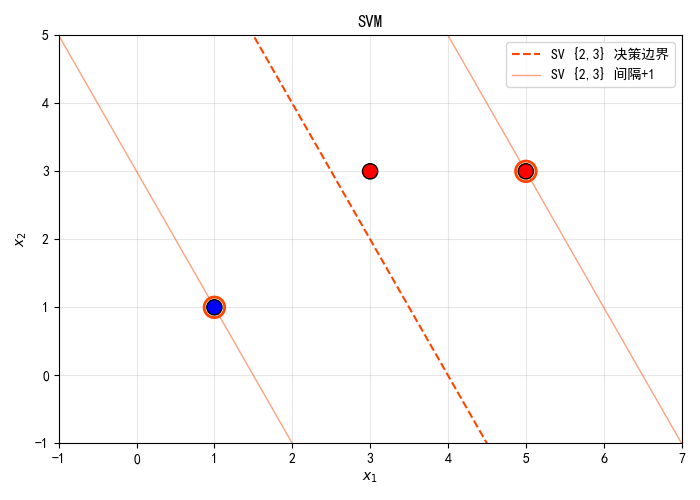
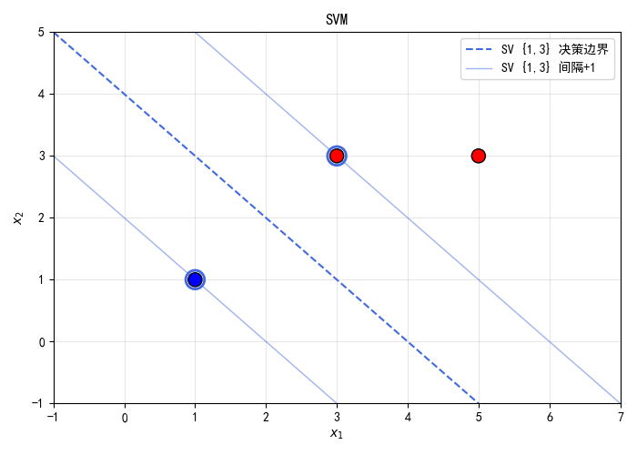

### 
 SVM作业

202440012028 陈新安

对于给定的正类样本 $x_1 = (3,3) x_2 = (5,3)$ 负类样本 $x_3 = (1,1)$ 
设决策边界为 $l : w_1x_1 + w_2x_2 + b = 0$
根据SVM的原理，可供选择的支撑向量有两组 $x_1, x_3$ 及 $x_2, x_3$
根据KKT条件 
$$
\begin{aligned}
\overrightarrow{w} - \sum^{s}_{i = 1} \lambda_i y_i \overrightarrow{x}_i &= 0 \\
-\sum^{s}_{i = 1}\lambda_i y_i &= 0\\
y_i * (\overrightarrow{w} * \overrightarrow{x_i} + b )  - 1 &\geqslant 0 \\
\lambda_i * (y_i * (\overrightarrow{w} * \overrightarrow{x_i} + b )  - 1 )& = 0 \\
\lambda_i &\geqslant 0
\end{aligned}
$$
得：

$$
\begin{cases}
\lambda_1 + \lambda_2 - \lambda_3 &= 0 \\
3w_1 + 3w_2 + b - 1 &\geqslant 0 \\
5w_1 + 3w_2 + b - 1 &\geqslant 0 \\
-w_1 - w_2 - b - 1 &\geqslant 0 \\
\lambda_1(3w_1 + 3w_2 + b - 1) &= 0 \\
\lambda_2(5w_1 + 3w_2 + b - 1) &= 0 \\
\lambda_3(-w_1 - w_2 - b - 1) &= 0 \\
\lambda_1 \geqslant 0 \quad \lambda_2 \geqslant 0 \quad \lambda_3 \geqslant 0 \\
w = (3\lambda_1 + 5\lambda_2 - \lambda_3, 3\lambda_1 + 3\lambda_2 - \lambda_3)
\end{cases}
$$

--- 

若选取 $x_2, x_3$ 作为支撑向量，则有
$$
\begin{cases}
\lambda_1 + \lambda_2 - \lambda_3 &= 0 \\
3w_1 + 3w_2 + b - 1 &\geqslant 0 \\
5w_1 + 3w_2 + b - 1 &= 0 \\
-w_1 - w_2 - b - 1 &= 0 \\
\lambda_1(3w_1 + 3w_2 + b - 1) &= 0 \\
\lambda_2(5w_1 + 3w_2 + b - 1) &= 0 \\
\lambda_3(-w_1 - w_2 - b - 1) &= 0 \\
\lambda_1 = 0 \quad \lambda_2 > 0 \quad \lambda_3 > 0 \\
w = (3\lambda_1 + 5\lambda_2 - \lambda_3, 3\lambda_1 + 3\lambda_2 - \lambda_3)
\end{cases}
$$

解得
$$
\begin{cases}
\lambda_2 = \lambda_3 = \frac{\sqrt{5}}{5} \\
\lambda_1 = 0 \\
w_1 = \frac{2}{5} \\
w_2 = \frac{1}{5} \\
b = -\frac{8}{5}
\end{cases}
$$
即
$||\overrightarrow{w}|| = \frac{\sqrt{5}}{5}$

又因为
$3w_1 + 3w_2 + b - 1  = -\frac{4}{5} < 0$
所以选取 $x_2, x_3$ 作为支撑向量时，得出的 $\overrightarrow{w}$ 不满足约束条件，故  $x_2, x_3$ 不是支撑向量
如图所示

  

    
  

---
若选取 $x_1, x_3$ 作为支撑向量，则有
$$
\begin{cases}
\lambda_1 + \lambda_2 - \lambda_3 &= 0 \\
3w_1 + 3w_2 + b - 1 &= 0 \\
5w_1 + 3w_2 + b - 1 &\geqslant 0 \\
-w_1 - w_2 - b - 1 &= 0 \\
\lambda_1(3w_1 + 3w_2 + b - 1) &= 0 \\
\lambda_2(5w_1 + 3w_2 + b - 1) &= 0 \\
\lambda_3(-w_1 - w_2 - b - 1) &= 0 \\
\lambda_1 \geqslant 0 \quad \lambda_2 = 0 \quad \lambda_3 \geqslant 0 \\
w = (3\lambda_1 + 5\lambda_2 - \lambda_3, 3\lambda_1 + 3\lambda_2 - \lambda_3)
\end{cases}
$$

解得
$$
\begin{cases}
\lambda_1 = \lambda_3 = \frac{1}{4} \\
\lambda_2 = 0 \\
w_1 = \frac{1}{2} \\
w_2 = \frac{1}{2} \\
b = 2
\end{cases}
$$
即
$||\overrightarrow{w}|| = \frac{\sqrt{2}}{2}$
又因为
$5w_1 + w_2 + b - 1  = 9 > 0$
所以选取 $x_1, x_3$ 作为支撑向量时，得出的 $\overrightarrow{w}$ 满足约束条件，故  $x_2, x_3$ 是一组可行的支撑向量
如图

  

    
  

**综上，决策边界为 $l : \frac{1}{2} x_1 + \frac{1}{2} x_2 + 2 = 0$**

