# 
 SVM lead in 
## Intro
简单来说 对于以下二（多）分类，我们希望找到一个超平面以分割两（几）类样本

  

    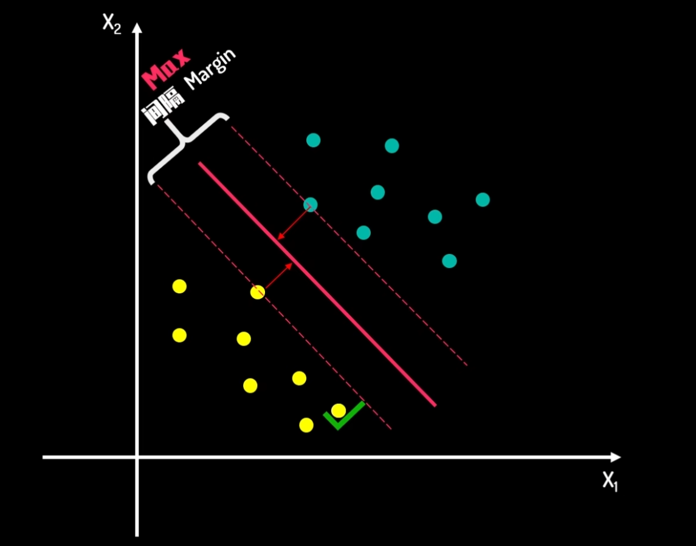
  

对于这样的一个超平面，需要最大化间隔以增强模型的泛化能力。满足这一条件的两个（或以上）样例就被称为支持向量

至于说有些数据是线性不可分的，我们可以通过升维进行处理（增加特征，提高维度）。也可以使用核方法避免高维度向量之间的乘积运算

  

    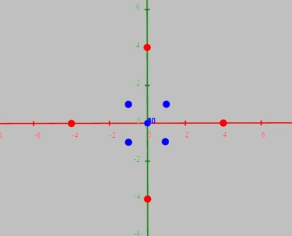
  

  

    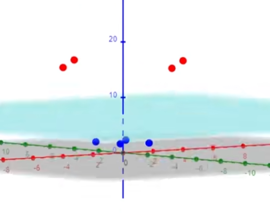
  

**硬间隔 SVM 的基本保证就是：**
一旦支撑向量确定，最大间隔  d = 2 / ||w||  就被这些支撑向量“卡死”；所有样本到决策边界的距离 ≥ d / 2，严格不小于。

---

## What The FVCK Is KKT

### 1. KKT 条件的定义

对于一个优化问题：

\[
\begin{aligned}
\min_{x} \quad & f(x) \\
\text{s.t.} \quad & g_i(x) \leq 0,\quad i=1,2,\dots,m \\
& h_j(x) = 0,\quad j=1,2,\dots,p
\end{aligned}
\]

- \(f(x)\)：目标函数，需最小化。  
- \(g_i(x)\leq 0\)：不等式约束。  
- \(h_j(x)=0\)：等式约束。  

引入拉格朗日函数：

\[
L(x,\lambda,\mu)=f(x)+\sum_{i=1}^{m}\lambda_i g_i(x)+\sum_{j=1}^{p}\mu_j h_j(x)
\]

- \(\lambda_i\geq 0\)：不等式约束乘子。  
- \(\mu_j\)：等式约束乘子。  

### 2. KKT 条件的四个部分

| 条件 | 数学表述 |
|---|---|
| 站点条件 **Stationarity** | \(\displaystyle \nabla_{\!x}\,L(x,\lambda,\mu)=0\) |
| 可行性条件 **Primal Feasibility** | \(\displaystyle g_i(x)\leq 0,\; h_j(x)=0\quad\forall i,j\) |
| 对偶可行性条件 **Dual Feasibility** | \(\displaystyle \lambda_i\geq 0\quad\forall i\) |
| 互补松弛条件 **Complementary Slackness** | \(\displaystyle \lambda_i\,g_i(x)=0\quad\forall i\) |

tips: $\displaystyle \nabla_{\!x}\,L(x,\lambda,\mu)=0 \Leftrightarrow \frac{\partial L(x,\lambda,\mu)}{\partial x} = 0$ 

### 3. 物理与几何解释

- **站点条件：**
这相当于在拉格朗日函数构造的拉格朗日乘子空间中寻找梯度为零的点，确保在最优点上不存在沿任何方向的下降空间。

- **可行性条件：**
优化问题的解必须满足所有的约束条件，这意味着解在约束空间内。

- **对偶可行性条件：**
对不等式约束的拉格朗日乘子必须为非负。这是因为拉格朗日乘子代表了约束对目标函数的影响，如果一个约束是非活跃的，那么它对目标函数的影响应该为零或正。

- **互补松弛条件：**
互补松弛条件反映了约束对优化问题的影响。如果一个约束是松弛的（即不被严格满足），它对优化问题的影响是零。如果约束被紧紧满足，它就会影响目标函数，表现为拉格朗日乘子的非零值。

### 4. 在支持向量机（SVM）中的应用

SVM 原始问题（硬间隔）：

\[
\begin{aligned}
\min_{w,b} \quad & \tfrac{1}{2}\|w\|^2 \\
\text{s.t.} \quad & y_i(w^T x_i+b)\geq 1,\quad i=1,\dots,n
\end{aligned}
\]

拉格朗日函数：

\[
L(w,b,\alpha)=\tfrac{1}{2}\|w\|^2-\sum_{i=1}^{n}\alpha_i\!\bigl[y_i(w^T x_i+b)-1\bigr],\quad \alpha_i\geq 0
\]

KKT 条件对应含义：

1. **Stationarity（站点条件）**  
   对 $w$ 和 $b$ 求偏导并令其为零，确保在最优解处, $w$ 和 $b$ 满足最优性条件：

\[
   \begin{aligned}
   \frac{\partial L}{\partial w}=0 &\;\Rightarrow\; w=\sum_{i=1}^{n}\alpha_i y_i x_i \\[4pt]
   \frac{\partial L}{\partial b}=0 &\;\Rightarrow\; \sum_{i=1}^{n}\alpha_i y_i=0 
   \end{aligned}
   \]

2. **Primal Feasibility（可行性条件）**  
   所有数据点必须满足：

\[
   y_i(w^T x_i+b)\geq 1,\quad i=1,\dots,n
   \]

   - 硬间隔：完全正确分类。  
   - 软间隔（引入松弛变量 $\xi_i$）：允许 $y_i(w^T x_i+b)\geq 1-\xi_i$，此时约束变为 $\xi_i\geq 0$ 并加入惩罚项 $C\sum_i\xi_i$。

3. **Dual Feasibility（对偶可行性条件）**  
   拉格朗日乘子非负：

\[
   \alpha_i\geq 0,\quad i=1,\dots,n
   \]

- 只有 $\alpha_i>0$ 的样本才会出现在 $w$ 的展开式中，这些样本被称为**支持向量**。

4. **Complementary Slackness（互补松弛条件）**  
   对每个样本：

\[
   \alpha_i\!\bigl[y_i(w^T x_i+b)-1\bigr]=0
   \]

   - 若 $y_i(w^T x_i+b)>1$（样本远离超平面），则必有 $\alpha_i=0$，即该点**不是支持向量**，对模型无影响。  
   - 若 $\alpha_i>0$，则必有 $y_i(w^T x_i+b)=1$，即该点**恰好位于间隔边界**，为支持向量。

---

## 数学推导（kkt方法）
回到这张图

  

    
  

假设现有一 $L$
$$
\begin{aligned}
 L = w_1x_1 + w_2x_2 + b
\end{aligned}
$$

目前数据都位于超平面上 绿色的点设为正例，函数值为1，黄色的则相反，设为-1
所以有
$$
\begin{aligned}
w_1x_1 + w_2x_2 + b &= 1 &正超平面\\
w_1x_1 + w_2x_2 + b &= 0 &决策超平面\\
w_1x_1 + w_2x_2 + b &= -1 &负超平面\\
\end{aligned}
$$

  

    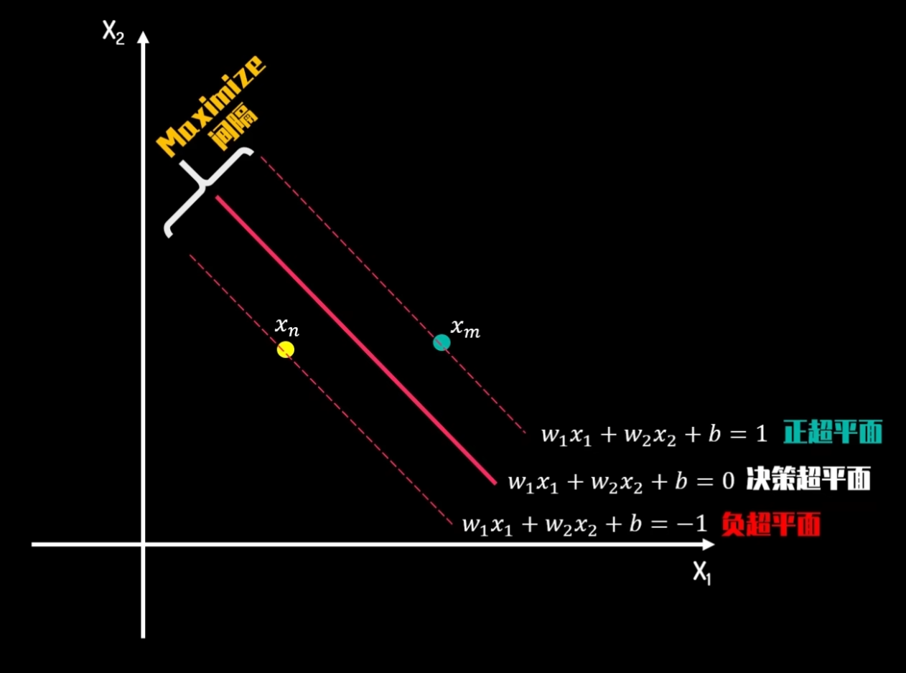
  

随机取两个点 $x_n, x_m$

可以得到 
$$
\begin{aligned}
w_1x_{1m} + w_2x_{2m} + b &= 1 &(1)\\
w_1x_{1n} + w_2x_{2n} + b &= -1 &(2)\\
\end{aligned}
$$
**(tips) 至于这里为什么是1和-1：** 原方程确实参数位应该是 $c_1$ 和 $c_2$，但将整个式子同处 $c_1, c_2$，整个式子呈现的效果没有变，只不过要求的参数被等比缩小（或放大）了，这其实没有实际上的影响，但求解确实更加方便了

(1)(2)相减，得到

$$
\begin{aligned}
w_1(x_{1m} - x_{1n})  + w_2(x_{2m} - x_{2n}) = 2 \quad(3)\\
\end{aligned}
$$

在向量的的视角下，有

$$
\begin{aligned}
\overrightarrow{w} \cdot (\overrightarrow{x_m} - \overrightarrow{x_n})  = 2 \quad (4)
\end{aligned}
$$

  

    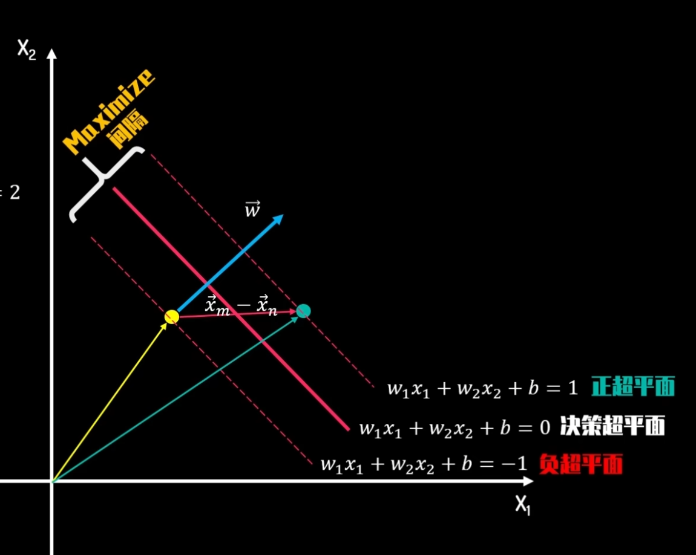
  

向量 $\overrightarrow{w}$ 始终垂直于直线 $L$
所以

$$
\begin{aligned}
\overrightarrow{w} \cdot (\overrightarrow{x_m} - \overrightarrow{x_n})  &= 2 \quad (4) \\ 
|| \overrightarrow{x_m} - \overrightarrow{x_n} || * cos \theta * || \overrightarrow{w}|| &= 2 \\
|| \overrightarrow{x_m} - \overrightarrow{x_n} || * cos \theta  &= L \\
L * || \overrightarrow{w}|| &= 2 \\
L &= \frac{2}{|| \overrightarrow{w}||}
\end{aligned}
$$

期望是最大化 $L$，这就等同于在约束条件下尽可能最小化向量 $\overrightarrow{w}$ 的长度

!!! : 三类优化问题：1、无约束条件，凸函数下求解极值点 2、 有等式约束，拉格朗日乘子进行求解 3、不等式约束 kkt条件下求解
很显然在这个问题下需要用到kkt求解

因为对于所有正类，$y_i = 1, w_1x_{1i} + w_2x_{2i} + b \geqslant  1$
对于所有负类，$y_i = -1, w_1x_{1i} + w_2x_{2i} + b \leqslant  -1$

所以约束条件可以优化成
$$
\begin{aligned}
y_i * (\overrightarrow{w} * \overrightarrow{x_i} + b )\geqslant 1
\end{aligned}
$$

最后的优化问题为
$$
\begin{aligned}
&\text{minimize} \quad f(w) = || \overrightarrow{w}|| \\
&\text{subject to } \quad  y_i * (\overrightarrow{w} * \overrightarrow{x_i} + b )\geqslant 1, i = 1, 2, 3, ..., s  
\end{aligned}
$$

为了方便求导

$$
\begin{aligned}
&\text{minimize} \quad f(w) =\frac{ || \overrightarrow{w}||^{2}}{2} \\
&\text{subject to}  \quad y_i * (\overrightarrow{w} * \overrightarrow{x_i} + b )\geqslant 1, i = 1, 2, 3, ..., s  
\end{aligned}
$$

很显然 这是一个在仿射函数约束下的凸优化问题
因为约束条件非等式，所以我们增加一个变量，让其变成等式
$$
\begin{aligned}
&\text{minimize} \quad f(w) =\frac{ || \overrightarrow{w}||^{2}}{2} \\
&\text{subject to} \quad g_i(w,b) = y_i * (\overrightarrow{w} * \overrightarrow{x_i} + b ) -  1 = p_i^2 , i = 1, 2, 3, ..., s  
\end{aligned}
$$

使用拉格朗日乘子法则进行求解
$$
\begin{aligned}
L(w,b, \lambda_i, p_i) = \frac{||\overrightarrow{w}||^2}{2} - \sum^{s}_{i = 1} \lambda_i * (y_i * (\overrightarrow{w} * \overrightarrow{x_i} + b ) -  1  - p_i^2) ,  \quad i = 1, 2, 3, ..., s  
\end{aligned} 
$$

分别求偏导
$$
\begin{aligned}
\frac{\partial{L}}{\partial{w}} = 0 \quad \frac{\partial{L}}{\partial{b}} = 0 \quad \frac{\partial{L}}{\partial{\lambda_i}} = 0 \quad \frac{\partial{L}}{\partial{p_i}} = 0
\end{aligned} 
$$

得到以下式子
$$
\begin{aligned}
\overrightarrow{w} - \sum^{s}_{i = 1}\lambda_i y_i \overrightarrow{x_i} &= 0  &(1)\\
-\sum^{s}_{i = 1}\lambda_i y_i &= 0 &(2)\\
y_i * (\overrightarrow{w} * \overrightarrow{x_i} + b ) -  1  - p_i^2 &= 0 &(3) \\
2\lambda_i p_i = 0 \rightarrow  \lambda_i p_i^2 &= 0 &(4) 
\end{aligned} 
$$

合并(3)(4)，得
$$
\begin{aligned}
\lambda_i * (y_i * (\overrightarrow{w} * \overrightarrow{x_i} + b ) -  1 ) = 0
\end{aligned} 
$$

又因为 $y_i * (\overrightarrow{w} * \overrightarrow{x_i} + b )\geqslant 1$

所以只能有两种可能 
$$
\begin{aligned}
y_i * (\overrightarrow{w} * \overrightarrow{x_i} + b )  - 1 &> 0, \lambda_i = 0 \\
y_i * (\overrightarrow{w} * \overrightarrow{x_i} + b ) - 1 &= 0, \lambda_i \not ={0} \\
\end{aligned} 
$$

**下面论证 $\lambda_i$ 非负**
法一

  

    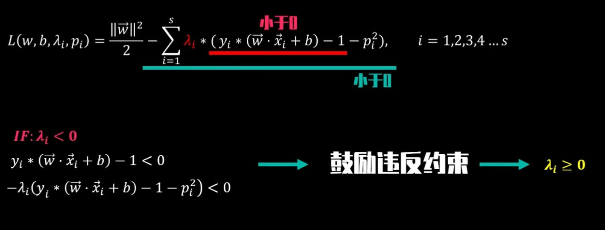
  

法二（几何法论证）

  

    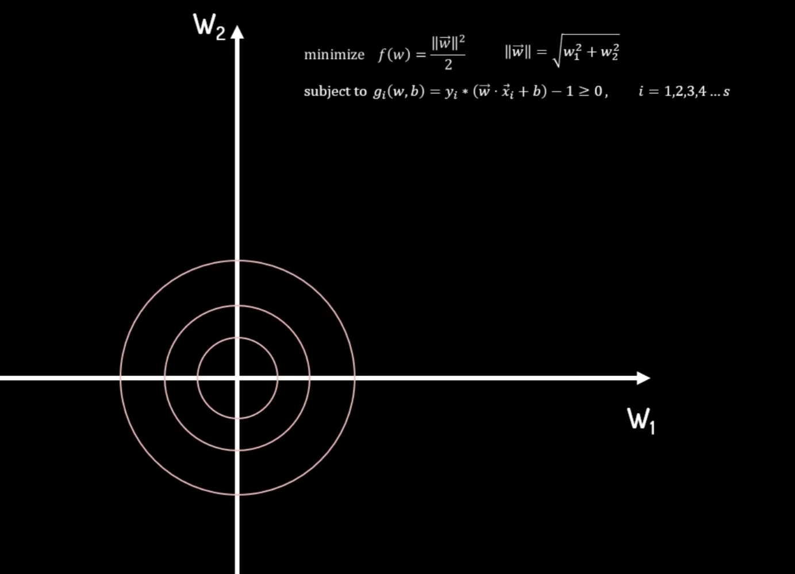
  

以 $w_1, w_2$ 作为横纵坐标，要让 $||w||$ 尽可能小，就是要让其尽可能靠近原点
在没有约束的条件下，很显然，最小值在原点处取得

  

    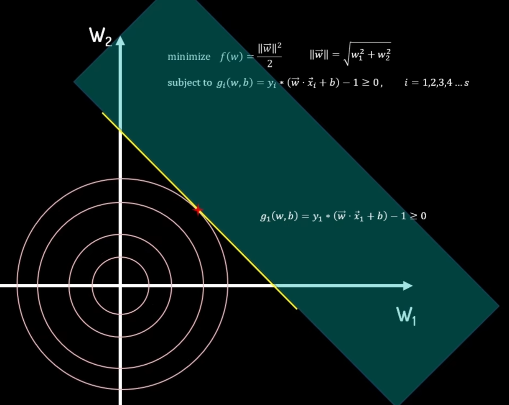
  

只有一个约束条件时，（绿色区域代表可行区域）最小值在等高线圆与约束条件边界相切处得到
此时切点 $f(x)$ 的梯度向量 $\nabla f$ 指向函数值增加最大的方向，即垂直切线方向
约束条件 $g_1(w,b)$ 的梯度向量 $\nabla g$ 与前一个梯度的方向一致

至于大小，可以用 $\lambda_1$ 使得 $\frac{\partial f}{\partial w}$ 与 $\lambda_1\frac{\partial g}{\partial w}$ 大小相同

  

    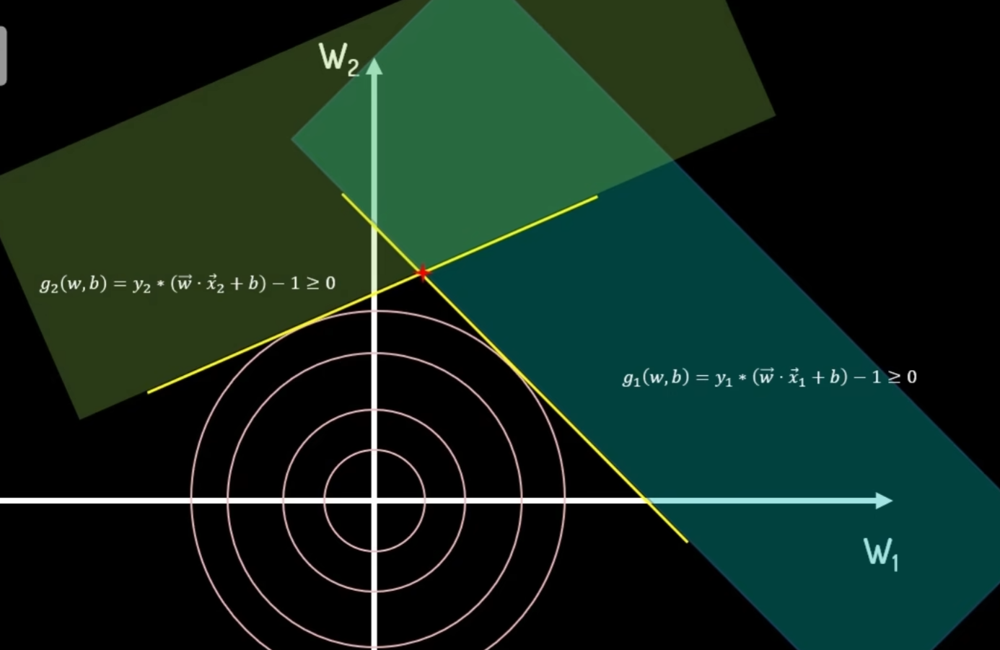
  

  

    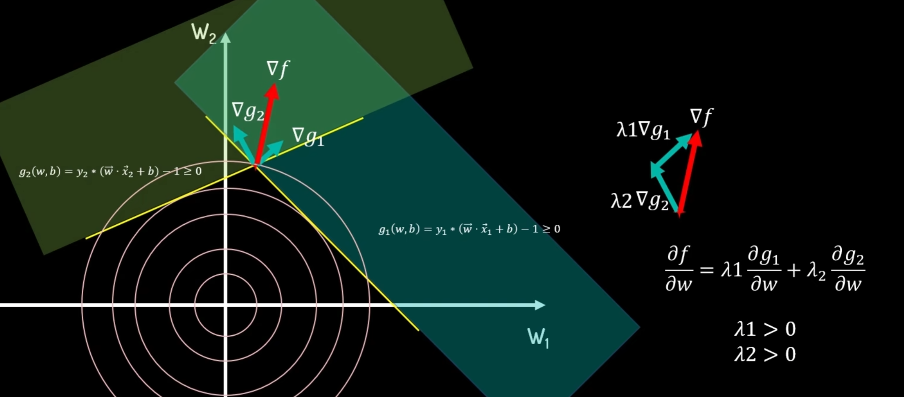
  

有两个约束条件时，各个梯度方向如图所示，也都不会小于0，（始终是同方向的）

  

    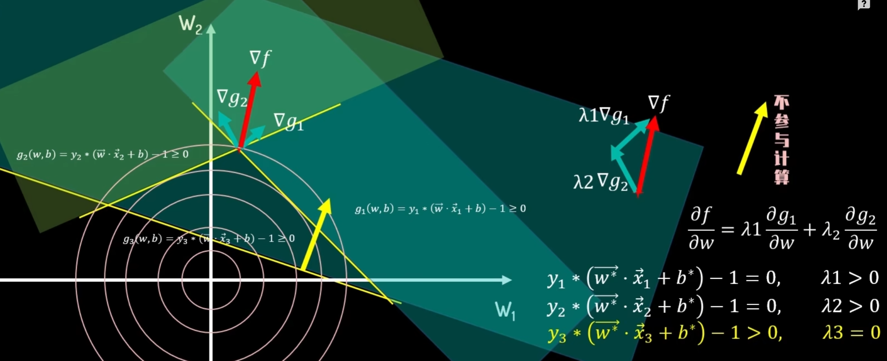
  

当有多个约束条件时，如图，出现了前两个约束条件所确定的最优解已经被包含在新增的第三个约束条件的范围内了，对于 $w$ 的最优解 $\overrightarrow{w}^*$， $y_3 * (\overrightarrow{w} * \overrightarrow{x_3} + b )  - 1 > 0, \lambda_3 = 0$ 

## 综上
KKT条件 
$$
\begin{aligned}
\overrightarrow{w} - \sum^{s}_{i = 1} \lambda_i y_i \overrightarrow{x}_i &= 0   \\
-\sum^{s}_{i = 1}\lambda_i y_i &= 0\\
y_i * (\overrightarrow{w} * \overrightarrow{x_i} + b )  - 1 &\geqslant 0 \\
\lambda_i * (y_i * (\overrightarrow{w} * \overrightarrow{x_i} + b )  - 1 )& = 0 \\
\lambda_i &\geqslant 0
\end{aligned}
$$

--- 

## 目前来说
硬间隔 + 线性模型 + 小样本 → 完全可以用 KKT 方程直接手算，
1. 先假设哪些个点是 SV（线性二维最多 2 个就够）；
2. 用 **KKT-互补松弛** 把对应约束写成等式；
3. 解线性方程 → 得到 λ、b、w；
4. 验证其余点是否满足 ≥1 的约束；
5. 若通过且 λ≥0，就算出一组 ‖w‖；
6. 把所有可能 SV 组合算完，取 ‖w‖ 最小的那一组即可。

--- 

## 对偶问题
朴素来说，假设对于一个二维的决策边界，我们是不是每次任选两个点计算 $||w||$ 就好了呢？
实际上并不是“任取几个样本算一算，矛盾的去掉，再取最小值”这种暴力枚举法。

SVM 有一套一次性的、全局最优的解法：
1. 先解一个二次规划（QP）问题
   目标：
   \[
   \min{\lambda}\;\frac12\sum{i,j}\lambda_i\lambda_j y_i y_j(x_i\cdot x_j)-\sum_i\lambda_i
   \quad\text{s.t.}\quad\sum_i\lambda_i y_i=0,\;0\le\lambda_i\le C
   \]
   这一步一次性就给出了所有样本的拉格朗日乘子 \(\lambda_i\)。

2. \(\lambda_i>0\) 的样本就是支撑向量；其余自动淘汰，根本不用试。

3. 用这些真正的支撑向量算出
   \[
   w=\sum{i\in\mathrm{SV}}\lambda_i y_i x_i,\quad \|w\|=\|w\|.
   \]
整个过程没有枚举组合，也没有“矛盾—去掉—再试”，而是一步 QP 直接告诉你谁是支撑向量，并同时给出对应的最小 \(\|w\|\)（即最大间隔）。

## 对偶问题下的数学推导

原问题：
$$
\begin{aligned}
&\text{minimize} \quad f(w) =\frac{ || \overrightarrow{w}||^{2}}{2} \\
&\text{subject to}  \quad g_i(w,b) = y_i * (\overrightarrow{w} * \overrightarrow{x_i} + b ) - 1\geqslant 0, i = 1, 2, 3, ..., s  
\end{aligned}
$$

可以得到一组最优解(极小值解) $w^*, b^*$

新方程：
$$
\begin{aligned}
&q(\lambda_i) = minimize(L(w,b,\lambda_i)) = minimize(f(w) - \sum^{s}_{i = 1}\lambda_i * g_i(w,b)), i = 1, 2, 3, 4, ..., s \\
&q(\lambda_i) = minimize(L(w,b,\lambda_i)) = minimize(f(w) - \sum^{s}_{i = 1}\lambda_i * g_i(w,b)) \leqslant f(\overrightarrow{w^*}) - \sum^{s}_{i = 1}\lambda_i * g_i(\overrightarrow{w^*},b^*) \\
&\lambda_i \geqslant 0 \\
&g_i(\overrightarrow{w^*},b) \geqslant 0
\end{aligned}
$$

**所以有：**
$$
q(\lambda_i) \leqslant f(\overrightarrow{w^*}) - \sum^{s}_{i = 1}\lambda_i * g_i(\overrightarrow{w^*},b^*) \leqslant f(\overrightarrow{w^*}) \leqslant f(w)
$$

到这里，我们想找到一个最优下界 $q(\lambda_i^*)$ 以替代 $f(\overrightarrow{w^*})$ 即：
$$
q(\lambda_i) \leqslant q(\lambda_i^*) \leqslant f(\overrightarrow{w^*}) \leqslant f(w)
$$

**所以可以得到对偶问题:**
$$
\begin{aligned}
&\text{maxmize} \quad q(\lambda_i) = maximize(minmize(L(w,b,\lambda_i))) \\
&\text{subject to} \quad \lambda_i \geqslant 0, i = 1, 2, 3, ..., s
\end{aligned} \\
q(\lambda_i^*) < f(\overrightarrow{w^*}) 弱对偶 \quad \quad q(\lambda_i^*) = f(\overrightarrow{w^*}) 强对偶 \  满足slater条件 
$$
eg 在当前仿射函数条件下求解凸优化问题
在强对偶条件下，对偶问题的最优解同时得到解决

**一个简单例子**

  

    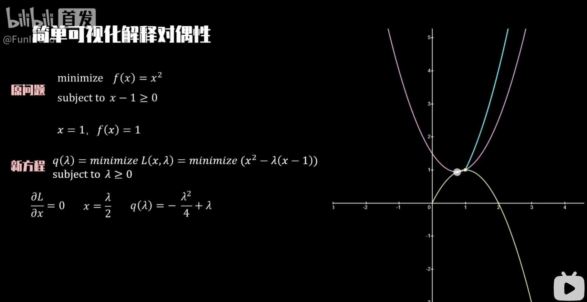
  

蓝色的是 $f(x)$， 紫色的是 不同 $\lambda$ 下的 $L(x,\lambda) = (x^2 - \lambda(x - 1)) $
黄色的是 $q(\lambda)$

黄色的轨迹落在原问题极值的下方，说明 $q(\lambda)$ 是原问题的下界
找最优下界，求 $q(\lambda)$  极大值

**回到原来**

对于给定 $\overrightarrow{w} - \sum^{s}_{i = 1}  \lambda_i y_i \overrightarrow{x}_i = 0   \qquad -\sum^{s}_{i = 1}\lambda_i y_i = 0$

$$
\begin{aligned}
    & \text{maximize} \quad q(\lambda) = \text{maximize}\left(\text{minimize}\left(\frac{\|\vec{w}\|^2}{2} - \sum^{s}_{i=1} \lambda_i * (y_i * (\vec{w} \cdot \vec{x}_i + b) - 1))\right) \right) \\
    & \text{subject to} \quad \lambda_i \geq 0, \quad i = 1, 2, 3, 4, \ldots s \\
    & \text{maximize} \quad q(\lambda_i) = \text{maximize}\left( \frac{1}{2} \left( \sum_{i=1}^{s} \lambda_i y_i \vec{x}_i \right) \cdot \left( \sum_{j=1}^{s} \lambda_j y_j \vec{x}_j \right) - \sum_{i=1}^{s} \lambda_i * \left( y_i * \left( \left( \sum_{j=1}^{s} \lambda_j y_j \vec{x}_j \right) \cdot \vec{x}_i + b \right) - 1 \right) \right) \\
    & \text{maximize} \quad q(\lambda_i) = \text{maximize}\left( \sum_{i=1}^{s} \lambda_i - \frac{1}{2} \sum_{i=1}^{s} \sum_{j=1}^{s} \lambda_i \lambda_j y_i y_j \vec{x}_i \cdot \vec{x}_j \right)
\end{aligned}
$$

**最精简：**
$$
\begin{aligned}
    & \text{maximize} \quad q(\lambda_i) = \text{maximize}\left( \sum_{i=1}^{s} \lambda_i - \frac{1}{2} \sum_{i=1}^{s} \sum_{j=1}^{s} \lambda_i \lambda_j y_i y_j \vec{x}_i \cdot \vec{x}_j \right)\\
    & \text{subject to } \quad \lambda_i \geqslant 0, i = 1, 2, 3,..., s
\end{aligned}
$$

得到 $\lambda_i$ 根据 $\overrightarrow{w} = \sum^{s}_{i = 1}  \lambda_i y_i \overrightarrow{x}_i $ 求解 $\overrightarrow{w}$ 再根据 $y_i * (\overrightarrow{w} * \overrightarrow{x_i} + b )  - 1   = 0$ 反解 $b$

又有 $\lambda_i * (y_i * (\overrightarrow{w} * \overrightarrow{x_i} + b )  - 1 )  = 0 $ 即只有在正负超平面上的支持向量能参与运算 $(\lambda_i \not = 0)$

同时，最优解仅与 $\overrightarrow{x}_i \cdot \overrightarrow{x}_j $ 决定（支持向量的空间相似度） 可通过核函数求解。 