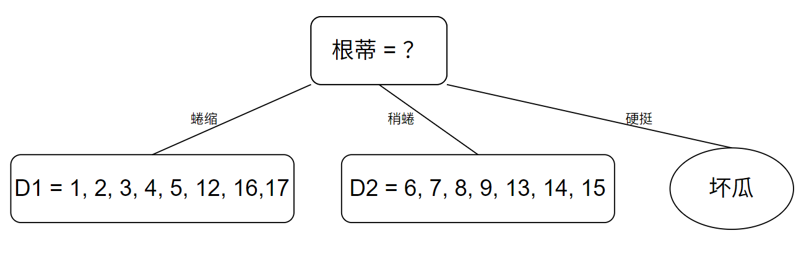
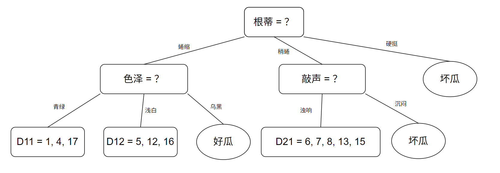

### 
 决策树作业

202440012028 陈新安

已知：
| 编号 | 色泽 | 根蒂 | 敲声 | 好瓜 || 编号 | 色泽 | 根蒂 | 敲声 | 坏瓜 |
|----|----|----|----|----|----|----|----|----|----|----|
| 1  | 青绿 | 蜷缩 | 浊响 | 是  || 9  | 乌黑 | 稍蜷 | 沉闷 | 否 |
| 2  | 乌黑 | 蜷缩 | 沉闷 | 是  || 10 | 青绿 | 硬挺 | 清脆 | 否 |
| 3  | 乌黑 | 蜷缩 | 浊响 | 是  || 11 | 浅白 | 硬挺 | 清脆 | 否 |
| 4  | 青绿 | 蜷缩 | 沉闷 | 是  || 12 | 浅白 | 蜷缩 | 浊响 | 否 |
| 5  | 浅白 | 蜷缩 | 浊响 | 是  || 13 | 青绿 | 稍蜷 | 浊响 | 否 |
| 6  | 青绿 | 稍蜷 | 浊响 | 是  || 14 | 浅白 | 稍蜷 | 沉闷 | 否 |
| 7  | 乌黑 | 稍蜷 | 浊响 | 是  || 15 | 乌黑 | 稍蜷 | 浊响 | 否 |
| 8  | 乌黑 | 稍蜷 | 浊响 | 是  || 16 | 浅白 | 蜷缩 | 浊响 | 否 |
|    |      |      |      |     || 17 | 青绿 | 蜷缩 | 沉闷 | 否 |

#### **第一次划分：**
首先计算出根节点的信息熵：
$$
Ent(D) = -\sum^{2}_{k = 1}p_klog_2p_k = -(\frac{8}{17}log_2\frac{8}{17} + \frac{9}{17}log_2\frac{9}{17}) = 0.998
$$

**色泽的信息增益：**
对色泽划分可得到三个子集，分别记为 $D^1$（色泽 = 青绿），$D^2$（色泽 = 乌黑），$D^3$（色泽 = 浅白）。
可得：

$$
\begin{aligned}
Ent(D^1) &= -(\frac{3}{6}log_2\frac{3}{6} + \frac{3}{6}log_2\frac{3}{6}) = 1.000 \\
Ent(D^2) &= -(\frac{4}{6}log_2\frac{4}{6} + \frac{2}{6}log_2\frac{2}{6}) = 0.918 \\
Ent(D^3) &= -(\frac{1}{5}log_2\frac{1}{5} + \frac{4}{5}log_2\frac{4}{5}) = 0.722
\end{aligned}
$$
则：
$$
\begin{aligned}
Gain(D,色泽) &= Ent(D) - \sum^{3}_{v = 1}\frac{|D^v|}{|D|}Ent(D^v)\\
& = 0.998 - (\frac{6}{17} * 1.000 + \frac{6}{17} * 0.918 + \frac{5}{17} * 0.722) \\
&= 0.109
\end{aligned}
$$

**根蒂的信息增益：**
对根蒂划分可得到三个子集，分别记为 $D^1$（根蒂 = 蜷缩），$D^2$（根蒂 = 稍蜷），$D^3$（根蒂 = 硬挺）。
可得：
$$
\begin{aligned}
Ent(D^1) &= -(\frac{5}{8}log_2\frac{5}{8} + \frac{3}{8}log_2\frac{3}{8}) = 0.954 \\
Ent(D^2) &= -(\frac{3}{7}log_2\frac{3}{7} + \frac{4}{7}log_2\frac{4}{7}) = 0.985 \\
Ent(D^3) &= -(\frac{0}{2}log_2\frac{0}{2} + \frac{2}{2}log_2\frac{2}{2}) = 0
\end{aligned}
$$
则：
$$
\begin{aligned}
Gain(D,根蒂) &= Ent(D) - \sum^{3}_{v = 1}\frac{|D^v|}{|D|}Ent(D^v)\\
& = 0.998 - (\frac{8}{17} * 0.954 + \frac{7}{17} * 0.985 + \frac{2}{17} * 0) \\
&= 0.143
\end{aligned}
$$

**敲声的信息增益：**
对根蒂划分可得到三个子集，分别记为 $D^1$（敲声 = 浊响），$D^2$（敲声 = 沉闷），$D^3$（敲声 = 清脆）。
可得：
$$
\begin{aligned}
Ent(D^1) &= -(\frac{6}{10}log_2\frac{6}{10} + \frac{4}{10}log_2\frac{4}{10}) = 0.971 \\
Ent(D^2) &= -(\frac{2}{5}log_2\frac{2}{5} + \frac{3}{5}log_2\frac{3}{5}) = 0.971 \\
Ent(D^3) &= -(\frac{0}{2}log_2\frac{0}{2} + \frac{2}{2}log_2\frac{2}{2}) = 0
\end{aligned}
$$
则：
$$
\begin{aligned}
Gain(D,敲声) &= Ent(D) - \sum^{3}_{v = 1}\frac{|D^v|}{|D|}Ent(D^v)\\
& = 0.998 - (\frac{10}{17} * 0.971 + \frac{5}{17} * 0.971 + \frac{2}{17} * 0) \\
&= 0.141
\end{aligned}
$$

**属性“根蒂”的信息增益最大，故被选为划分属性**

第一次划分后：

  

          
  

#### **第二次划分：**
在第一次划分后，得：
$D_1: $
| 编号 | 色泽 | 敲声 | 好瓜 || 编号 | 色泽 | 敲声 | 坏瓜 |
|----|----|----|----|----|----|----|----|----|
| 1  | 青绿 | 浊响 | 是  || 12 | 浅白 | 浊响 | 否 |
| 2  | 乌黑 | 沉闷 | 是  || 16 | 浅白 | 浊响 | 否 |
| 3  | 乌黑 | 浊响 | 是  || 17 | 青绿 | 沉闷 | 否 |
| 4  | 青绿 | 沉闷 | 是  ||    |      |      |    |
| 5  | 浅白 | 浊响 | 是  ||    |      |      |    |

$D_2: $
| 编号 | 色泽 | 敲声 | 好瓜 || 编号 | 色泽 | 敲声 | 坏瓜 |
|----|----|----|----|----|----|----|----|----|
| 6  | 青绿 | 浊响 | 是  || 9  | 乌黑 | 沉闷 | 否 |
| 7  | 乌黑 | 浊响 | 是  || 13 | 青绿 | 浊响 | 否 |
| 8  | 乌黑 | 浊响 | 是  || 14 | 浅白 | 沉闷 | 否 |
|    |      |      |     || 15 | 乌黑 | 浊响 | 否 |

**在$D_1$中进行划分**
首先计算出根节点的信息熵：
$$
Ent(D_1) = -\sum^{2}_{k = 1}p_klog_2p_k = -(\frac{5}{8}log_2\frac{5}{8} + \frac{3}{8}log_2\frac{3}{8}) = 0.954
$$

**色泽的信息增益：**
对色泽划分可得到三个子集，分别记为 $D_1^1$（色泽 = 青绿），$D_1^2$（色泽 = 乌黑），$D_1^3$（色泽 = 浅白）。
可得：

$$
\begin{aligned}
Ent(D_1^1) &= -(\frac{2}{3}log_2\frac{2}{3} + \frac{1}{3}log_2\frac{1}{3}) = 0.918 \\
Ent(D_1^2) &= -(\frac{0}{2}log_2\frac{0}{2} + \frac{2}{2}log_2\frac{2}{2}) = 0 \\
Ent(D_1^3) &= -(\frac{1}{3}log_2\frac{1}{3} + \frac{2}{3}log_2\frac{2}{3}) = 0.918
\end{aligned}
$$
则：
$$
\begin{aligned}
Gain(D_1,色泽) &= Ent(D_1) - \sum^{3}_{v = 1}\frac{|D_1^v|}{|D_1|}Ent(D_1^v)\\
& = 0.954 - (\frac{3}{8} * 0.918 + \frac{3}{8} * 0.918 + \frac{2}{8} * 0) \\
&= 0.266
\end{aligned}
$$

**敲声的信息增益：**
对根蒂划分可得到两个子集，分别记为 $D^1$（敲声 = 浊响），$D^2$（敲声 = 沉闷）。
可得：
$$
\begin{aligned}
Ent(D_1^1) &= -(\frac{3}{5}log_2\frac{3}{5} + \frac{2}{5}log_2\frac{2}{5}) = 0.971 \\
Ent(D_1^2) &= -(\frac{2}{3}log_2\frac{2}{3} + \frac{1}{3}log_2\frac{1}{3}) = 0.918 
\end{aligned}
$$
则：
$$
\begin{aligned}
Gain(D_1,敲声) &= Ent(D_1) - \sum^{2}_{v = 1}\frac{|D_1^v|}{|D_1|}Ent(D_1^v)\\
& = 0.954 - (\frac{5}{8} * 0.971 + \frac{3}{8} * 0.918 ) \\
&= 0.002
\end{aligned}
$$

**$D_1$中属性“色泽”的信息增益最大，故被选为划分属性**

**在$D_2$中进行划分**
首先计算出根节点的信息熵：
$$
Ent(D_2) = -\sum^{2}_{k = 1}p_klog_2p_k = -(\frac{3}{7}log_2\frac{3}{7} + \frac{4}{7}log_2\frac{4}{7}) = 0.985
$$

**色泽的信息增益：**
对色泽划分可得到三个子集，分别记为 $D_2^1$（色泽 = 青绿），$D_2^2$（色泽 = 乌黑），$D_2^3$（色泽 = 浅白）。
可得：

$$
\begin{aligned}
Ent(D_2^1) &= -(\frac{1}{2}log_2\frac{1}{2} + \frac{1}{2}log_2\frac{1}{2}) = 1.000 \\
Ent(D_2^2) &= -(\frac{2}{4}log_2\frac{2}{4} + \frac{2}{4}log_2\frac{2}{4}) = 1.000 \\
Ent(D_2^3) &= -(\frac{0}{1}log_2\frac{0}{1} + \frac{1}{1}log_2\frac{1}{1}) = 0
\end{aligned}
$$
则：
$$
\begin{aligned}
Gain(D_2,色泽) &= Ent(D_2) - \sum^{3}_{v = 1}\frac{|D_2^v|}{|D_2|}Ent(D_2^v)\\
& = 0.985 - (\frac{2}{7} * 1.000 + \frac{4}{7} * 1.000 + \frac{1}{7} * 0) \\
&= 0.128
\end{aligned}
$$

**敲声的信息增益：**
对根蒂划分可得到两个子集，分别记为 $D^1$（敲声 = 浊响），$D^2$（敲声 = 沉闷）。
可得：
$$
\begin{aligned}
Ent(D_2^1) &= -(\frac{3}{5}log_2\frac{3}{5} + \frac{2}{5}log_2\frac{2}{5}) = 0.971 \\
Ent(D_2^2) &= -(\frac{0}{2}log_2\frac{0}{2} + \frac{2}{2}log_2\frac{2}{2}) = 0 
\end{aligned}
$$
则：
$$
\begin{aligned}
Gain(D_2,敲声) &= Ent(D_2) - \sum^{2}_{v = 1}\frac{|D_2^v|}{|D_2|}Ent(D_2^v)\\
& = 0.985 - (\frac{5}{7} * 0.971 + \frac{2}{7} * 0 ) \\
&= 0.291
\end{aligned}
$$
**$D_2$中属性“敲声”的信息增益最大，故被选为划分属性**

第二次划分后：

  

          
  

#### **第三次划分：**
在第二次划分后，得：
$D_{11}$
| 编号 | 敲声 | 好瓜 || 编号 | 敲声 | 坏瓜 |
|----|----|----|----|----|----|----|
| 1  | 浊响 | 是  || 17 | 沉闷 | 否 |
| 4  | 沉闷 | 是  ||    |      |    |

$D_{12}$
| 编号 | 敲声 | 好瓜 || 编号 | 敲声 | 坏瓜 |
|----|----|----|----|----|----|----|
| 5  | 浊响 | 是  || 12 | 浊响 | 否 |
|    |      |     || 16 | 浊响 | 否 |

$D_{21}$
| 编号 | 色泽 | 好瓜 || 编号 | 色泽 | 坏瓜 |
|----|----|----|----|----|----|----|
| 6  | 青绿 | 是  || 13 | 青绿 | 否 |
| 7  | 乌黑 | 是  || 15 | 乌黑 | 否 |
| 8  | 乌黑 | 是  ||    |      |    |

在$D_{11}$中，敲声为浊响则为好瓜。敲声为沉闷时，好瓜坏瓜均有1个。又因为在$D_{11}$中，总体上好瓜的占比大于坏瓜，故当色泽为青绿时，判定为好瓜。

在$D_{12}$中，敲声均为浊响。又因为在$D_{12}$中，总体上坏瓜的占比大于好瓜，故当色泽为浅白时，判定为坏瓜。

在$D_{21}$中，总体上好瓜多于坏瓜。当 色泽 = 青绿时，好瓜与坏瓜各占其一，且在$D_{21}$ 中 好瓜多余坏瓜，故当色泽为青绿时，判定为好瓜。当色泽为乌黑时，好瓜比例多于坏瓜，故当色泽为乌黑时均判定为好瓜。

#### 最终结果：

  

          
  

