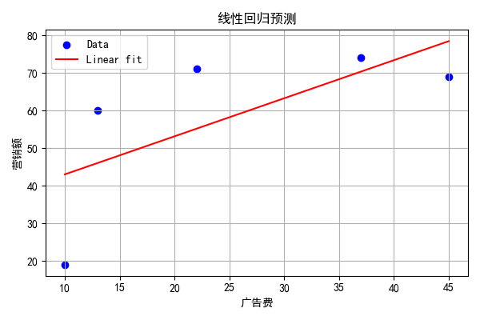

### 
 线性回归作业
已知
|广告费|销售额|
|---|---|
|10|19
|13|60|
|22|71|
|37|74|
|45|69|

求广告费与销售额之间的线性回归预测模型。

设 $y = \omega x + b$， $y$ 代表 销售额， $x$ 代表广告费。
根据数据，可求得：
$$
\overline{x} = \sum_{i = 1}^{5}x_i = 25.4 \\
\sum_{i = 1}^{5}y_i(x_i- \overline{x}) = 932.8 \quad \quad
\sum_{i = 1}^{5}x_i^2 - \frac{(\sum_{i = 1}^{5}x_i)^2}{5} = 921.2 \\
\omega = \frac{\sum_{i = 1}^{5}y_i(x_i- \overline{x})}{\sum_{i = 1}^{5}x_i^2 - \frac{(\sum_{i = 1}^{5}x_i)^2}{5}} = 1.013 \\
b = \frac{\sum_{i = 1}^{5}(y_i - \omega x_i)}{5} = 32.880
$$  

综上，得线性回归公式 $y = 1.013x + 32.880$

  

         
  

