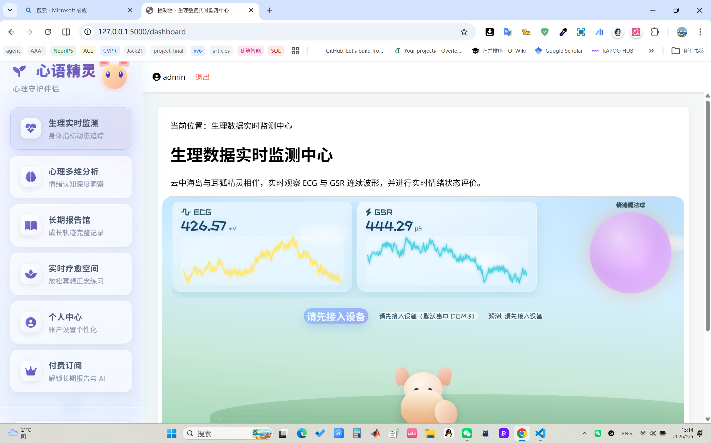

# 个人简历

## 个人信息

- **姓名**：陈新安
- **学号**：202440012028
- **学院**：人工智能学院
- **绩点**：3.87 / 5.0 &nbsp;·&nbsp; **专业排名**：2 / 94
- **联系方式**：
  - 微信：Asuka0096
  - 邮箱：929983875@qq.com / 202440012028@m.scnu.edu.cn

---

## 个人优势

- 熟练掌握 **C++**、**Python** 等常用编程语言
- 多次参与数学建模竞赛，具备扎实的建模分析能力与团队协作经验
- 多次担任课程设计及实践项目的负责人，有一定的组织管理经验
- 日常学习与开发中广泛使用 AI 辅助工具（如 OpenCode 等 Agent 工具），具备 **AI Coding** 实践经验

---

## 项目经历

###  金种子项目（2025，已结题）

**项目名称**：基于传播学的创新设计与应用——AI 赋能的心理健康与情感陪伴产品

**岗位**：技术岗

**主要工作**：
- 负责应用 Web 端的设计与前后端开发
- 负责模型训练与测试

**项目地址**：[github.com/AsukaLec/projectFinal](https://github.com/AsukaLec/projectFinal)

  <figure>
    
    <figcaption><strong>图 1.</strong> 金种子项目成果预览</figcaption>
  </figure>

